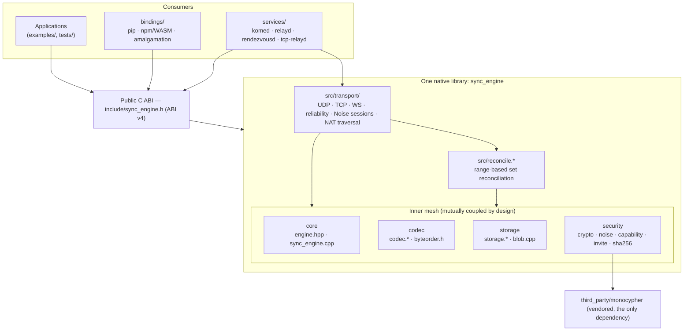
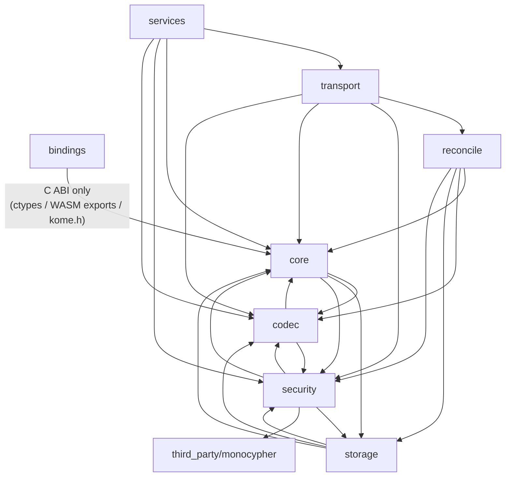
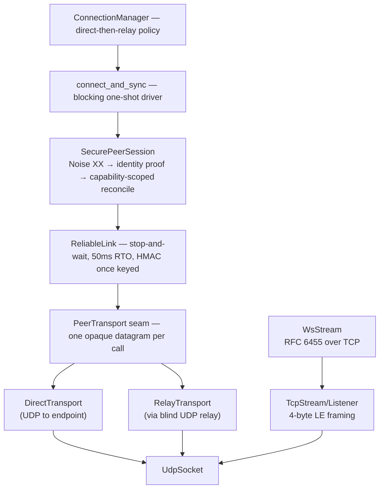

# Architecture

A map of the repository: what each subsystem does, how they depend on each
other, and how data flows through the engine at runtime. For the *why* behind
individual decisions see [DECISIONS.md](../DECISIONS.md); for the data model,
storage format, and security model see [DATA_MODEL.md](DATA_MODEL.md),
[STORAGE.md](STORAGE.md), and [../SECURITY.md](../SECURITY.md).

Kome is a private, offline-first P2P sync engine: a convergent (CRDT) data
core, wrapped by an incremental sync protocol, an encrypted/authenticated
transport with NAT traversal, deployable daemons, and three packaging
channels (pip, npm/WASM, single-file amalgamation). The single third-party
dependency is vendored [monocypher](https://monocypher.org); storage is a
dependency-free append-only log.

*Generated 2026-08-20 from a full source survey at `master` (`c11927e`).
ABI version 4, project version 0.1.0.*

## Bird's-eye view

Everything native compiles into **one library** (`sync_engine`, from the
`sync_engine_obj` CMake object library). Module boundaries are directories and
namespaces, not link units. The **public C ABI** — the single umbrella header
[`include/sync_engine.h`](../include/sync_engine.h), symbols `sync_*` — is the
only surface bindings and applications see; the "opaque" engine handle is
opaque only across that boundary.

Layering facts worth knowing (verified from the include graph):

- **`reconcile` is a pure top-level consumer** inside the library: nothing in
  `src/` includes `reconcile.h` except its own `.cpp`. It plugs into the
  engine through cache fields the core hosts for it (`state_gen`,
  `recon_cache`, `scoped_cache` in `engine.hpp`), keeping the dependency
  direction reconcile→core. Transport reaches it only through the public
  session ABI (`sync_session_*`).
- **`transport` is one-directional**: it consumes core/codec/security/
  reconcile, but nothing in `src/` outside `src/transport/` includes a
  transport header. Only `services/`, `tools/`, and `examples/` do.
- **The inner four modules (core, codec, storage, security) are a mutual
  mesh** at module granularity — e.g. `sync_engine.cpp → storage.h` while
  `storage.h → engine.hpp`. There are no *file-level* include cycles: headers
  layer cleanly (`engine.hpp` sits under `codec.h`/`storage.h`/
  `capability.h`); the module cycles come from `.cpp` files reaching back
  down. This is deliberate: one library, boundaries by directory.
- **Hubs**: `src/crypto.h` (~15 includers, every module), `src/byteorder.h`,
  `src/codec.h`, and the core pair `engine.hpp` + `include/sync_engine.h`.
  Inside transport, `udp.h` is the hub — every other transport header pulls
  it for `Endpoint`.
- **Leaves**: `include/sync_engine.h` (system headers only),
  `third_party/monocypher` (reached only from `crypto.cpp`), `byteorder.h`,
  `crypto.h`, `sha256.h`, `reconcile.h`, `transport/{udp,cookie,reliable}.h`.
- **Bindings never touch C++**: Python binds via ctypes over
  `libsync_engine.so`, WASM via Emscripten-exported `_sync_*` functions,
  the amalgamation ships the ABI header verbatim as `kome.h`. The only
  binding↔engine coupling surface is `include/sync_engine.h`.

## Repository map

| Path | What lives there |
|---|---|
| `include/sync_engine.h` | The public C ABI — one umbrella header for the whole library |
| `src/` | Core engine, codec, storage, reconciliation, security (one flat directory) |
| `src/transport/` | Byte movers, reliability, secure sessions, NAT traversal, relays |
| `services/` | Four deployable daemons: `komed`, `relayd`, `rendezvousd`, `tcp-relayd` |
| `bindings/python/` | `kome` pip package (ctypes over the shared library) |
| `bindings/wasm/` | `kome-sync` npm package (Emscripten WASM binding) |
| `bindings/wasm-runtime/` | `kome-sync-runtime` npm package (TS WebSocket sync loop over the WASM binding) |
| `third_party/monocypher/` | Vendored Monocypher 4.0.2 — the only dependency |
| `tests/` | ~27 gtest suites, shell E2E tests, `tests/fuzz/` (10 libFuzzer targets) |
| `bench/` | GoogleBenchmark microbenchmarks with big-O reporting |
| `examples/` | C consumer, localhost demos, real-network nodes, browser demo |
| `tools/` | Amalgamation generator, WASM/npm build scripts, coverage, real-network test harnesses |
| `docs/` | Design docs: data model, storage, packaging, scenarios, perf, real-network testing |
| `.github/workflows/` | Ten workflows: per-PR gates, nightly deep passes, tag-triggered release |

## Module dependency graph

Module-level edges, each verified by an `#include`, a call, or a CMake link
dependency (the full file-level include graph is in the
[appendix](#appendix-file-level-include-graph)):

Representative evidence per edge:

| Edge | Via |
|---|---|
| core → codec | `sync_engine.cpp` uses `encode_signing` (the signature domain), `dup_field`, LE helpers |
| core → security | `engine.hpp` embeds `KeyPair`; `apply_change` calls `verify` + `cap_authorize_write` |
| core → storage | write-through helpers call `Storage::begin/commit/put_*`; open replays the log |
| codec → core | `codec.h` includes `engine.hpp` for `PubKey`/`Sig`; implements ABI types from `sync_engine.h` |
| codec → security | `sync_change_sign` calls `keypair_from_seed` + `sign` |
| storage → core | `Storage::load/compact` read and write `sync_engine` state directly |
| storage → codec | log framing uses varints, `DecodedChange`, `encode_signing` for replay re-verification |
| storage → security | frame checksums/AEAD, Ed25519 re-verification, capability replay, `secure_wipe` |
| reconcile → core | builds snapshots from the engine maps; calls `apply_change`; manages engine-hosted caches |
| reconcile → storage | `batch_begin`/`batch_commit` stage a received batch into one fsync'd frame |
| security → core | `capability.h` includes `engine.hpp` (CapStore lives on the engine) |
| security → storage | `put_capability`/`put_revocation` persist grants and revocations |
| transport → reconcile | `connection.cpp:84` drives `sync_session_begin_scoped` and the whole step/pump loop |
| transport → security | `NoiseChannel` (handshake, encrypt, identity proof); `hmac_sha256`, cookies, per-op EdDSA |
| services → transport | `komed` composes `SecurePeerSession`/`ConnectionManager`; the other three wrap server cores |
| bindings → core | C ABI only: ctypes over `libsync_engine`, Emscripten `_sync_*` exports, `kome.h` |

## Subsystems

### Core — the CRDT engine

`include/sync_engine.h`, `src/engine.hpp`, `src/sync_engine.cpp`

The convergent data core (milestone M1) and the public C ABI. The data model:

- **HLC** — hybrid logical clock `{physical ms, logical}`; `tick()` for local
  events, `receive()` merges a remote timestamp monotonically. Total order
  `hlc_cmp = (physical, logical)`.
- **Register** — `{value, hlc, author pubkey, signature}` with total order
  `register_cmp = (hlc, author, value)`; larger wins on merge (LWW).
- **Entity** — an LWW *presence* register (present bit + HLC + author + sig;
  tombstones are absence assertions) plus a `map<field, Register>`.
  `presence_hlc {0,0}` is reserved for "no assertion yet", so a field-only
  entity (register arrived before any existence record) is distinguishable
  from a tombstoned one.
- **State** — `map<ns, map<entity, Entity>>`. Sorted maps give the canonical
  byte-lexicographic order that scan, export, digest, and reconciliation all
  share (no sort passes anywhere).

The unit of replication is the `sync_change` record — always authored and
EdDSA-signed. The merge (`ke::apply_change`) is idempotent, commutative, and
associative; the pipeline is **dominance → signature → capability → mutate →
clock adopt → persist**. LWW dominance is checked *before* signature
verification because EdDSA verify is ~100× the rest of apply
(docs/PERF.md): dominated records are dropped for free, and this is safe
because a rejected record touches no state and a forged winner still gets
verified. Only accepted records advance the HLC, so local writes always tick
strictly ahead of anything the engine has seen.

The ABI: lifecycle (`create` / `open` / `open_encrypted` / `destroy`), local
ops (`set` / `delete`), reads (`get` / `exists` / `scan` — no capability
check; read scoping happens at sync time), the full-state `export`/`apply`
baseline, and a deterministic `digest` (SHA-256 over a canonical tagged walk
of the sorted maps, including hidden registers under tombstones; equal
digests ⇔ converged). Every `extern "C"` body catches all exceptions — none
crosses the boundary. The header is an umbrella: it also declares the codec,
session, capability, invite, and blob functions implemented in sibling
modules.

`struct sync_engine` is deliberately defined in the internal `engine.hpp`, so
storage, reconcile, and capability manipulate engine fields directly. It also
hosts reconcile's snapshot caches (`state_gen`, `recon_cache`, per-peer
`scoped_cache`) via a forward declaration, keeping the dependency direction
reconcile→core.

### Codec — canonical serialization and the signature domain

`src/codec.h`, `src/codec.cpp`, `src/byteorder.h`

One canonical, versioned (v3), little-endian encoding of `sync_change`
records — used identically on the wire, in the storage log, and as the
**EdDSA signature domain**: `encode_signing`'s output is byte-for-byte what
gets signed and verified, which is why format versions are not backward
compatible and the decoder hard-rejects anything but v3.

Wire form of a record: `[version][kind][ns][entity]` + kind-specific body
(existence: present bit + HLC; register: field + value + HLC) +
`[author 32B][signature 64B]`, with varint-length-prefixed byte fields.
Records are self-delimiting (`decode` reports consumed bytes); outer framing
is each caller's job (storage: u32le length-prefixed frames; reconcile:
varint lists; transports: their own framing).

Varint decoding enforces the unique minimal LEB128 form — an explicit
anti-malleability measure, since two encodings of the same logical record
would churn reconciliation fingerprints and evade dedup. Beyond records, the
codec's primitives (`put_varint`/`get_varint`, the `byteorder.h` LE helpers)
are the repo-wide serialization toolkit used by storage framing, reconcile
fingerprints, capability/invite/relay/rendezvous wire forms.

### Storage — append-only log + blobs

`src/storage.h`, `src/storage.cpp`, `src/blob.cpp` — see
[STORAGE.md](STORAGE.md)

Durability (M2): full state lives in RAM; disk is a single append-only log of
length-prefixed, checksummed frames (SHA-256[0:8]) — or AEAD-sealed frames
(XChaCha20-Poly1305) for `open_encrypted` — with Bitcask-style compaction
bounding the file to O(live state). It replaced an earlier SQLite layer.

- **Write path**: write-through — one mutation = one atomic, fsync'd frame
  (entity/field records + persisted HLC/db-clock meta). During bulk sync
  ingest, `batch_begin`/`batch_commit` collapse N records into one frame and
  one fsync.
- **Read path**: `load()` replays every intact frame into RAM, stopping at
  the first torn/corrupt frame, and **re-verifies every record signature**
  (parallelized across up to 8 threads for n≥64; a swapped log file cannot
  inject forged records). Replay merges through the same LWW rules as the
  network path, so recovery is order-independent — the property that makes
  sync converge makes crashes safe.
- **Open never writes**: torn-tail truncation and open-time compaction are
  deferred to the first write, so a concurrent read-only opener (`komed
  --identity`, monitoring) can never truncate a frame the live owner just
  committed.
- **Compaction** is crash-atomic (temp file + fsync + rename + dir fsync),
  triggered at file > max(64 KiB, 2× last-compacted size) — amortized O(1)
  write amplification. Tombstones older than 30 days are GC'd during
  compaction only (a peer offline longer may resurrect a delete — the same
  bound Earthstar documents).
- **The log file is the identity**: the node's private seed lives in a meta
  frame (chmod 0600 best-effort; treat like an SSH key).

The blob extension (`blob.cpp`) is a pure client of the public C ABI — it
never touches `engine.hpp` state. Values are chunked at 32 KiB, chunks and
manifests stored as ordinary entities keyed by BLAKE2b-256 content hash, so
blobs (≤ ~31.25 MiB) replicate, converge, and get capability-checked exactly
like any other record. Manifests arrive from untrusted peers and are parsed
defensively.

### Reconcile — range-based set reconciliation

`src/reconcile.h`, `src/reconcile.cpp`

The incremental sync protocol (M3): two peers discover exactly which records
differ and exchange only those. The session API is `sync_session_begin` /
`_begin_scoped` / `step` / `end` — a half-duplex ping-pong of messages the
transport ferries.

How it works: each side snapshots its state as a sorted element list (one
element per entity-existence and per field register; element = canonical
record bytes + SHA-256 hash). Fingerprints are homomorphic 256-bit sums of
element hashes, finalized as SHA-256(count ‖ sum), so any sub-range
fingerprint is an O(1) prefix-sum delta. The initiator opens with one
fingerprint over (−∞, +∞); on mismatch a range splits into up to 16
equal-count buckets (`kBuckets`); ranges of ≤2 elements exchange the actual
records via LEAF/HAVE descriptors. Cost: O(log₁₆ n) round-trips to localize
a diff; a converged idle gossip link costs O(1) per cycle thanks to the
`state_gen`-keyed snapshot cache.

Notable properties:

- **Scoped sessions** (`begin_scoped`) filter unauthorized namespaces out of
  the snapshot *before* any fingerprint is computed, so scoped-out data never
  leaks even through fingerprints. Per-peer scoped snapshots are cached
  (≤256 peers, invalidated on every state change); time-bound read
  capabilities force per-cycle rebuilds so expiry stays exact.
- **Security piggyback**: capability delegations and revocations ride the
  first message of a session and are ingested *before* that message's records
  are applied — a key revoked in the same message has its writes rejected.
- **Sessions pin a snapshot** (shared_ptr): records applied mid-session never
  invalidate in-flight ranges; convergence is the union of both sides'
  start-of-session snapshots, and changes made during the session ride the
  next cycle.
- **Hardening**: outgoing messages capped at 48 KiB (headroom under the
  relay's 64 KiB blob limit); receive-side decode bounded by three budgets
  (8 MiB message, 2²⁰ elements, 2¹⁶ descriptors); 2²⁰-step session lifetime
  cap; canonical-encoding enforcement on every received record; reply
  amplification bounded per incoming message.
- **Batch apply**: received batches stage into one fsync'd storage frame, and
  batches ≥16 verify signatures across ≤8 threads (native builds; serial
  under Emscripten).

### Security — identity, channel, capabilities

`src/crypto.*`, `src/noise.*`, `src/capability.*`, `src/invite.cpp`,
`src/sha256.*`, `third_party/monocypher` — see [../SECURITY.md](../SECURITY.md)

Four layers (M4):

1. **Primitives** — `crypto.h` is a thin facade over vendored Monocypher
   4.0.2 (EdDSA-BLAKE2b, X25519, BLAKE2b, XChaCha20-Poly1305, constant-time
   compares) plus an in-repo SHA-256 and a hand-rolled HMAC-SHA256/HKDF
   (Monocypher has no SHA-256). Identity is a dual keypair (EdDSA signing +
   X25519 agreement), both derived deterministically from one 32-byte seed
   via domain-separated BLAKE2b; `site_id = BLAKE2b-256(sign_pk)`. Entropy
   comes from `/dev/urandom` only.
2. **Channel** — `NoiseChannel` implements Noise XX (mutual authentication,
   forward secrecy) with XChaCha20-Poly1305 as the AEAD — deliberately *not*
   wire-compatible with standard Noise (documented in DECISIONS.md). Noise
   authenticates only the X25519 statics, so the long-term EdDSA identity is
   bound separately: each side signs the final transcript hash under the
   label `kome-channel-bind-v1`, exchanged as the mandatory first
   post-handshake message (missing/invalid proof = MITM = hard fail). A
   `reliability_key` derived from the transcript MACs the reliable-framing
   layer. `decrypt` authenticates before advancing the receive nonce, so
   forged frames cannot desync the counter.
3. **Capabilities** — signed tokens forming attenuating delegation chains per
   namespace, rooted at a self-signed root that is **never accepted over the
   wire**: ownership is only established by a local `sync_engine_grant`, and
   gossiped delegations can only extend locally-anchored chains. Attenuation
   is enforced at mint time *and* re-computed at query time (a hand-crafted
   over-broad delegation is harmless). Revocations are a grow-only set;
   revoking a key also severs everything it sub-delegated. Enforcement is
   opt-in per namespace: no root ⇒ open. Wire ingest is capped at 4096
   caps/revs (DoS bound).
4. **Invites** — `sync_invite_encode/decode` packs a peer pubkey, rendezvous
   address, and optional capability into an out-of-band blob (neither signed
   nor encrypted — the capability inside carries its own signature; the
   out-of-band channel provides confidentiality).

### Transport — byte movers to secure sessions

`src/transport/` (10 units)

Strict bottom-up stack (M5), transport-agnostic above the bottom layer:

- **Byte movers** all present the same one-message-per-call shape: `UdpSocket`
  (≤64 KiB datagrams), `TcpStream` (4-byte LE length framing, 64 MiB cap),
  `WsStream` (RFC 6455 with handshake, masking, fragmentation — browser
  compatible, verified against the RFC example vector).
- **`ReliableLink`** turns a lossy link into an ordered stream: stop-and-wait
  (matches the one-message-in-flight reconcile protocol), cumulative acks,
  50 ms RTO. After the handshake it is keyed via `enable_mac`; from then on
  unauthenticated frames can never change state (careful key-boundary
  semantics, constant-time tag compare).
- **`SecurePeerSession`** composes NoiseChannel + ReliableLink + a scoped
  reconcile session: handshake → mandatory identity proof → reconcile cycles
  encrypted through the channel. Gossip mode re-snapshots only at cycle
  boundaries (never mid-cycle — that would rebuild an O(state) snapshot per
  applied record). `connect_and_sync` adds pre-auth stall recovery
  (full re-handshake, 2 s→30 s backoff — *only* pre-auth; post-auth resets
  would thrash) and quiesce-based completion.
- **NAT traversal**: there is no dedicated hole-punch module — the punch *is*
  `ConnectionManager`'s direct attempt: simultaneous UDP sends to reflexive
  endpoints learned from the rendezvous, which doubles as the reflexive
  observer because registration and peer traffic share one socket (one NAT
  mapping). Full-cone NATs punch; symmetric NATs fall back to the relay.
  `stun.*` is a standalone RFC 5389 primitive for tools and the NAT
  simulator, not the production managed path. IPv4 only.
- **Two relays with different semantics**: the UDP relay (`relay.*`) is a
  drain-on-fetch FIFO addressed by peer identity — a live `PeerTransport`
  path; the TCP relay (`tcp_relay.*`, issue #49) is a *retained log*
  addressed by a dedicated mailbox keypair with client-held cursors and
  non-destructive paginated FETCH — built for shared circle mailboxes and
  NAT/CGNAT clients that cannot receive UDP. Every TCP-relay op is
  individually EdDSA-signed over a transcript bound to the server key, a
  per-connection nonce, and a strictly-increasing counter (captured
  signatures are worthless elsewhere). Push wakes are privacy-shaped
  (opaque handles, no mailbox/sender/size, 30 s debounce).
- **Server-side defenses** are shared and stateless: SYN-cookie-style
  return-routability cookies (HMAC over a 10 s time window, domain-separated
  per purpose) gate rendezvous register/lookup and relay fetch; the TCP relay
  runs a single-threaded poll loop with per-IP token buckets charged *before*
  parsing or any signature work, plus per-connection frame/TX/error budgets.

Everything above the byte movers is transport-agnostic through the
`PeerTransport` seam — `transport_parity_test` runs the full
Noise+reliability+reconcile stack over UDP, TCP, and WebSocket with identical
scenarios.

### Services — four deployable daemons

`services/{komed,relay,rendezvous,tcp_relay}/`

Thin `main()`s around library code, built as separate executables:

| Daemon | Port | Role |
|---|---|---|
| `komed` | — | Always-on headless peer: opens a durable engine, dials configured peers over the production secure path, accepts inbound sessions (bounded, LRU-evicts only unauthenticated ones) |
| `relayd` | udp/9001 | Blind UDP store-and-forward relay (31 lines; all logic in `transport/relay.*`) |
| `rendezvousd` | udp/9002 | Pubkey → reflexive-endpoint broker (31 lines; logic in `transport/rendezvous.*`) |
| `tcp-relayd` | tcp/9003 | Blind TCP mailbox relay with retained logs, TTL sweeps, push-notifier seam |

The infrastructure daemons are **blind by construction**: they carry only
ciphertext and hold no decryption capability — `tcp_relay.cpp` never calls
`aead_decrypt`/`x25519`/`sign`, and even `tcp-relayd`'s optional identity
seed is `secure_wipe`d immediately after extracting the public half. This is
proven by tests, not just asserted: a static source scan
(`tcp_relay_test.cpp`), frame-sink plaintext-marker assertions
(`tcp_relay_service_test.cpp`), and an end-to-end grep of a real daemon's
`--dump-frames` output (`tcp_relayd_test.sh`).

`komed` is the one substantial service (~1100 lines): config-file + CLI
parsing, a `<db>.lock` pidfile single-writer lock (Storage itself takes no
lock), rendezvous registration and relay fallback, and a heavily-documented
session-role policy — per-edge Noise initiator derived from
`memcmp(my_pk, peer_pk) < 0` so mutually-listed daemons converge with zero
operator coordination, plus self-promotion/livelock/restart-detection
refinements learned from real deployments (annotated FINDINGs in the source).

### Bindings & packaging — three channels, one ABI

`bindings/`, `pyproject.toml`, `tools/amalgamate.py` — see
[PACKAGING.md](PACKAGING.md)

All channels (M7) bind the same C ABI; none reimplements engine logic. The
distribution name is `kome-sync` on both registries (`kome` is squatted); C
symbols stay `sync_*`; the Python import name is `kome`. Version is
single-sourced from CMake `project(VERSION)`.

- **Python (pip)** — ctypes over `libsync_engine` (no compiled extension, so
  one `py3-none-<platform>` wheel covers every Python ≥3.8). Deliberately
  narrow surface: KV + full-state export/apply + digest; no
  sessions/capabilities/networking (documented scope decision).
- **WASM (npm)** — `bindings/wasm/binding.cjs` is the single JS
  implementation over Emscripten exports (explicit heap marshalling); four
  entry points choose split-file vs. single-file (base64-embedded) builds for
  Node/browser. Exposes nearly the whole ABI including sessions, blobs,
  capabilities, invites, and IDBFS persistence. The WASM build excludes
  `src/transport` entirely — browser I/O is the app's WebSocket driving the
  session ABI.
- **`kome-sync-runtime` (npm)** — TypeScript layer that turns the manual
  session pump into a running system: `GossipPeer` (mirrors
  `connection.cpp`'s pump loop), `SyncClient` (dialer with reconnect/backoff),
  `SyncHub` (a `ws` server running a responder per connection against one hub
  engine, giving transitive convergence). Its trust model is explicitly
  weaker than native and documented: read-scoping keys off the client's
  self-reported `?pubkey=` — no Noise XX identity proof (the WASM surface
  exposes no signing primitive) — fit for own-device/self-deployed hubs
  behind TLS + bearer token.
- **Amalgamation** — `tools/amalgamate.py` emits `kome.h` + `kome.cpp`
  (SQLite-style): monocypher inlined, sources concatenated in dependency
  order, transports behind `#ifndef KOME_NO_TRANSPORT` (the same portable
  core the WASM build proves out). Pure concatenation with hard drift checks;
  output is generated, never committed; CI runs the full test suite from it.

A subsystem-wide invariant: **packaging gates test the installed artifact,
never the build tree** — wheels are pytest-ed from a clean venv, the npm
tarball is installed into a fresh project, the amalgamation gate is literally
`c++ -c kome.cpp` plus a C99 consumer.

### Build, tests, CI

`CMakeLists.txt`, `tests/`, `bench/`, `tools/`, `.github/workflows/`

One `CMakeLists.txt` builds everything: `sync_engine_obj` fans out to static
and shared libs (or is rebuilt from the generated amalgamation under
`SYNC_AMALGAMATION`); under Emscripten only the library plus the
transport-agnostic suites build. Test taxonomy:

- **Transport-agnostic in-process suites** (14) — convergence oracle
  (semilattice properties), reconcile, crypto, security, multinode gossip
  over ring/star/mesh, scenario matrices, and product-shaped app suites
  (`circles_test`, `messaging_test` — a social app and a chat app driven
  purely through the public API). These run natively *and* compiled to WASM
  under Node — WASM parity is a first-class ctest gate, not a smoke test.
- **Native-only suites** — storage durability (fork-based crash tests),
  threading, real sockets, transport parity, TCP relay service.
- **Opt-in heavy suites** — stress (deterministic adversarial),
  OOM (allocation-failure injection via `--wrap`), chaos
  (SIGKILL/restart daemons mid-gossip, verify no committed-data loss).
- **Shell E2E** — real `komed` and `tcp-relayd` processes over real sockets,
  verified through the Python binding.
- **Fuzzing** — 10 libFuzzer targets covering every externally-controlled
  parse surface (record decode, capability decode, session, apply, storage,
  noise, stun, reliable, ws, invite).

CI: per-PR, `ci.yml` runs a five-configuration matrix — Release, Debug, and
three sanitizers (ASan, TSan, UBSan) — all `-Werror`, plus separate WASM,
amalgamation, wheels, npm, coverage, and DCO gates. Nightly runs the full
suite twice, scale tests (N=250 gossip), chaos ×3, and 5-hour-per-target
fuzzing with corpora cached across nights. `release.yml` re-invokes the
packaging workflows via `workflow_call` (a release ships exactly what CI
gated) and publishes via OIDC trusted publishing only. A tier of
real-network verification deliberately lives outside CI in `tools/`
(netns topologies, adversary simulation, public-STUN interop).

## Data-flow walkthroughs

### A local write

`sync_engine_set(e, ns, entity, field, value)` →

1. Fresh HLC `tick()` (strictly ahead of everything the engine has seen).
2. Build the `sync_change`, canonical-encode its signing bytes (codec), sign
   with the engine's EdDSA identity (security).
3. Mutate the in-memory maps (presence assertion if needed + field register).
4. `state_gen++` — invalidates reconcile's snapshot caches.
5. If durable: one write-through storage transaction — entity/field records +
   clock meta sealed into one fsync'd frame, then a compaction check.

### A sync between two peers (production path)

1. **Transport**: `ConnectionManager` tries the direct path (simultaneous
   UDP to rendezvous-learned reflexive endpoints — the hole punch), falls
   back to the blind relay.
2. **Channel**: Noise XX handshake over the reliable link; the transcript
   keys the link's HMAC; the first encrypted message must be the identity
   proof binding the peer's EdDSA key to this session.
3. **Session**: the proven peer key opens a capability-read-scoped reconcile
   session. Fingerprint ping-pong narrows differing ranges 16× per
   round-trip; leaves exchange records. Capabilities/revocations ride the
   first message and are ingested before its records.
4. **Ingest**: each record — canonical-decode → dominance gate → signature
   verify (parallel for batches ≥16) → capability check → merge → clock
   adopt → staged into one fsync'd storage frame per batch.
5. **Convergence**: both sides quiesce; equal digests prove convergence.

### Durable open

`sync_engine_open(path, seed)` → `Storage::open` validates the header (and
at-rest key if encrypted) → `load()` replays intact frames into RAM,
re-verifying every signature and merging via the same LWW rules as the
network path → identity/HLC/db-clock restored from meta → torn-tail
truncation and any pending compaction deferred to the first write.

## Cross-cutting invariants

These hold across module boundaries and explain much of the design:

1. **One canonical encoding is the signature domain.** The codec's
   `encode_signing` bytes are what is signed, verified, stored, fingerprinted,
   and shipped. Minimal-varint enforcement and exact-consume decoding make
   the encoding injective — no malleability, no fingerprint churn.
2. **Verify-on-win.** Signature verification is ~100× the rest of apply, so
   LWW dominance is decided first and dominated records are dropped free.
   Storage replay, network apply, and export/apply all share the identical
   merge, so recovery, sync, and baseline replication converge identically.
3. **Records are trusted nowhere.** Signatures are checked on network ingest
   *and* re-checked on every log replay; capability authorization gates every
   accepted remote record; read scoping is enforced by filtering snapshots
   before fingerprints exist.
4. **Infrastructure is blind.** Relays and rendezvous carry ciphertext,
   hold no decrypting key material, and their blindness is enforced by tests
   (source scans, frame-sink assertions, E2E greps).
5. **DoS bounds are explicit and pervasive.** Message caps, decode budgets,
   session step limits, ingest caps, mailbox quotas with LRU eviction,
   stateless cookies, rate limits charged before crypto — every untrusted
   surface has a named bound, and every one is fuzzed.
6. **The C ABI is the only boundary.** No exception crosses it, memory
   ownership is per-function, bindings never link C++ — which is what makes
   one engine servable as a wheel, a WASM module, and a two-file drop-in.
7. **Parity is gated, not assumed.** The same scenario suites pass on native
   UDP/TCP/WS, on WASM under Node, and on the amalgamation; packaging gates
   run against installed artifacts.
8. **Open never writes; writes are atomic.** Read-only opens are safe beside
   a live writer; every commit is one fsync'd frame; compaction is
   crash-atomic and best-effort.

## Appendix: file-level include graph

First-party `#include` edges (sources: `src/`, `include/`, `services/`,
`tools/`; system headers and tests omitted). `sync_engine.h` means
`include/sync_engine.h`; other bare names live in `src/`.

**Core / codec / storage / reconcile / security:**

| From | Includes |
|---|---|
| `sync_engine.cpp` | `sync_engine.h`, `engine.hpp`, `codec.h`, `byteorder.h`, `crypto.h`, `capability.h`, `sha256.h`, `storage.h` |
| `engine.hpp` | `sync_engine.h`, `crypto.h` |
| `codec.h` | `sync_engine.h`, `engine.hpp` |
| `codec.cpp` | `codec.h`, `byteorder.h`, `crypto.h` |
| `storage.h` | `sync_engine.h`, `engine.hpp` |
| `storage.cpp` | `storage.h`, `byteorder.h`, `capability.h`, `codec.h`, `crypto.h`, `sha256.h` |
| `blob.cpp` | `sync_engine.h`, `byteorder.h`, `crypto.h` |
| `reconcile.cpp` | `reconcile.h`, `sync_engine.h`, `engine.hpp`, `codec.h`, `byteorder.h`, `capability.h`, `crypto.h`, `sha256.h`, `storage.h` |
| `crypto.cpp` | `crypto.h`, `sha256.h`, `third_party/monocypher/monocypher.h` |
| `sha256.cpp` | `sha256.h` |
| `noise.h` | `crypto.h` |
| `noise.cpp` | `noise.h`, `sha256.h` |
| `capability.h` | `sync_engine.h`, `engine.hpp` |
| `capability.cpp` | `capability.h`, `byteorder.h`, `codec.h`, `crypto.h`, `storage.h` |
| `invite.cpp` | `sync_engine.h`, `codec.h` |

**Transport** (all paths `src/transport/` unless noted):

| From | Includes |
|---|---|
| `udp.cpp` | `udp.h` |
| `stun.h` / `stun.cpp` | `udp.h` / `stun.h`, `crypto.h` |
| `cookie.cpp` | `cookie.h`, `byteorder.h`, `crypto.h` |
| `reliable.cpp` | `reliable.h`, `byteorder.h`, `crypto.h` |
| `relay.h` / `relay.cpp` | `cookie.h`, `udp.h` / `relay.h`, `codec.h` |
| `rendezvous.h` / `rendezvous.cpp` | `crypto.h`, `cookie.h`, `udp.h` / `rendezvous.h`, `codec.h`, `crypto.h` |
| `connection.h` | `sync_engine.h`, `noise.h`, `relay.h`, `reliable.h`, `udp.h` |
| `connection.cpp` | `connection.h`, `engine.hpp`, `noise.h`, `reliable.h` |
| `tcp.h` / `tcp.cpp` | `udp.h` / `tcp.h`, `byteorder.h` |
| `tcp_relay.h` / `tcp_relay.cpp` | `tcp.h`, `udp.h` / `tcp_relay.h`, `byteorder.h`, `codec.h`, `crypto.h` |
| `ws.h` / `ws.cpp` | `tcp.h` / `ws.h`, `crypto.h` |

**Services and tools:**

| From | Includes |
|---|---|
| `services/komed/komed_main.cpp` | `sync_engine.h`, `engine.hpp`, `transport/connection.h`, `transport/rendezvous.h`, `transport/udp.h` |
| `services/relay/relay_main.cpp` | `transport/relay.h`, `transport/udp.h` |
| `services/rendezvous/rendezvous_main.cpp` | `transport/rendezvous.h`, `transport/udp.h` |
| `services/tcp_relay/tcp_relay_main.cpp` | `transport/tcp_relay.h`, `byteorder.h`, `crypto.h` |
| `tools/stun_interop.cpp` | `transport/stun.h`, `transport/udp.h` |

Link-level dependencies not visible as includes (from `CMakeLists.txt`):
`sync_engine_obj` publicly links vendored monocypher (inlined instead under
`SYNC_AMALGAMATION`); the daemons link `sync_engine` (komed and the
network examples additionally link monocypher directly); bindings reach the
engine only through `libsync_engine` (ctypes) or the Emscripten-exported ABI.
