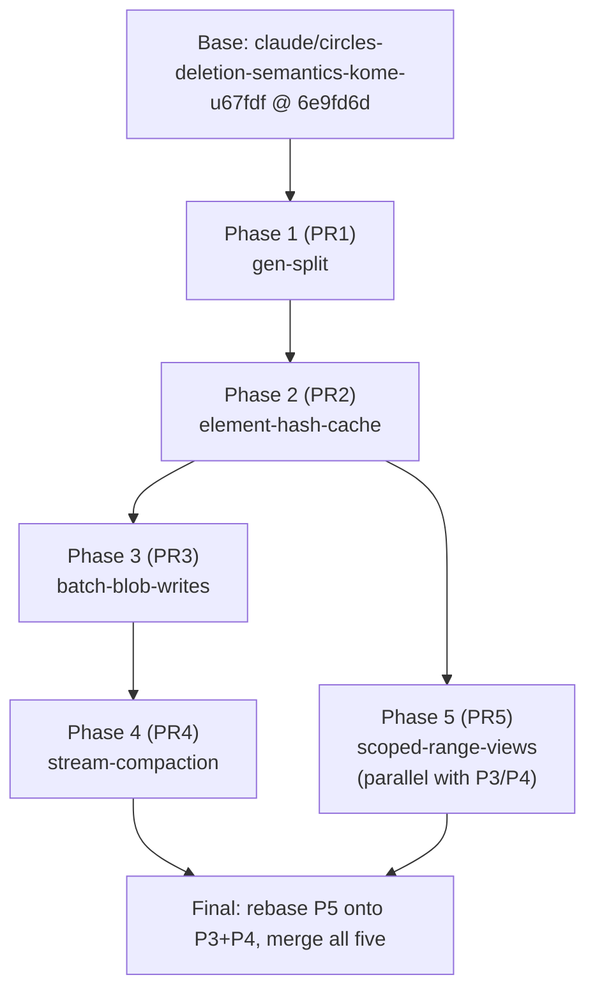

# Kome Improvement Plan

**Base branch:** `claude/circles-deletion-semantics-kome-u67fdf` @ `6e9fd6d` (adds `sync_engine_compact`, `sync_blob_erase`, `sync_engine_erase_field` to the C ABI, `tests/erase_test.cpp`, and `storage_test` erasure tests). Every change below assumes this commit as its parent and preserves its physical-erasure guarantee.

**Hard invariants carried through every phase, unconditionally:** byte-lexicographic ordered iteration (RBSR, `sync_engine_scan`'s exclusive `upper_bound` cursor at `src/sync_engine.cpp:505`, digest determinism); digest unchanged across compaction; rename-as-commit-point crash safety of compaction; the erase-then-tombstone-then-compact physical-erasure guarantee; snapshot immutability for in-flight sessions (`shared_ptr`); RBSR wire compatibility (fingerprints byte-identical); additive-only C ABI; no new dependencies; WASM keeps building.

---

## 1. Overview

Five improvements ship as five stacked, independently revertible PRs against the base branch:

1. **gen-split** — split the single `state_gen` invalidation counter into `content_gen` (the element set) and `scope_gen` (capability/read-scope state), so a grant/revoke/ingest stops discarding the O(N) unscoped RBSR snapshot.
2. **element-hash-cache** — cache each cell's reconciliation-element SHA-256 on the cell itself at mutation time, so snapshot rebuild stops re-hashing every record.
3. **batch-blob-writes** — expose `Storage`'s internal batching as a nestable C-ABI batch and wrap the three blob paths in it, collapsing hundreds of fsync'd mutations into a handful of fsync'd sub-frames.
4. **stream-compaction** — replace compaction's build-the-whole-image-in-RAM path with a bounded streaming writer to the temp file, cutting the transient from O(state) to O(one frame).
5. **scoped-range-views** — replace the never-cached, full-rebuild scoped snapshot for time-bound (capability-expiry-gated) peers with an immutable range view over the shared unscoped snapshot, cached until the earliest relevant capability deadline.

**Why this order.** Two of the five designs make competing self-interested ordering claims ("land me first"), and both turn out to be wrong on inspection, so the order below is adjudicated from the verified code rather than taken from either design:

- The gen-split design claims element-hash-cache has a semantic dependency on it ("its invalidation key should be `content_gen`"). This is false: element hashes live on `Register`/`Entity` and are maintained at mutation time — they are keyed by nothing and are never evicted by a gen bump. The real coupling between the two is textual only: the four new `element_hash(...)` call sites in Phase 2 sit adjacent to the four `state_gen++` sites Phase 1 renames in `src/sync_engine.cpp`.
- The gen-split design also claims scoped-range-views has a hard dependency on it ("do not start item 4 before this merges"), while the scoped-views design claims the opposite ("do views first"). Both overstate it: a view cache keyed on one `state_gen` plus a deadline is still *correct*, merely over-invalidated on capability-only changes. The real coupling is that both designs rewrite `ensure_scoped_cache` (`src/reconcile.cpp:680-723`), and that the `ke::GenPair` Phase 1 introduces is exactly the validity stamp Phase 5's `ReconView` wants.

Given that, **gen-split goes first** because it is the cheapest possible first move (~45 behavior-bearing lines), it *deletes* `state_gen` rather than aliasing it — so every later diff is compile-forced to classify its own invalidation as content or scope instead of inheriting an ambiguous counter — and it delivers a standalone, independently valuable win. **Element-hash-cache goes second** because it owns the exact `emit_element`/`build_snapshot` region (`src/reconcile.cpp:553-632`) that scoped-range-views also touches — landing it first makes Phase 5's rebase mechanical (two call sites, one added parameter) instead of a real merge conflict — and because Phase 5's Debug cross-check rebuilds a full filtered snapshot on every view build, so cheap per-element hashing directly protects sanitizer CI wall time.

After that the DAG forks into two file-disjoint tracks that can proceed in parallel: a **storage track** (batch-blob-writes → stream-compaction, both confined to `storage.{h,cpp}`, `sync_engine.cpp`'s `tx_*` helpers, and `blob.cpp`) and a **reconcile track** (scoped-range-views, confined to `reconcile.cpp`, `capability.{h,cpp}`, and the cache fields of `engine.hpp`). Within the storage track, batch-blob-writes lands before stream-compaction: its test infrastructure (the frame/fsync-counting helper, the erase-tombstone-prefix truncation sweep, the fork-based mid-batch-crash test) becomes the regression bed stream-compaction's rewrite must then pass, and it establishes — as tested requirements, not review-time promises — the two behaviors stream-compaction leans on: `compact()` refusing while `in_tx_` is set, and `maybe_compact` firing only from the outermost `batch_commit` after `commit()` clears `in_tx_`. Scoped-range-views merges last: it is the largest change, the only one that moves scope enforcement from physical absence to index arithmetic, and the one that benefits most from Phases 1–2 being in place first.



**Shared infrastructure, built once and reused:**

- `tests/log_frames.hpp` (Phase 3): walks `[len u32le][body][sha8]` / `[len][nonce24][ct][mac16]` frame boundaries; reused by Phase 4 for the determinism and stale-tmp tests.
- `ke::GenPair` (Phase 1, `engine.hpp`): consumed by Phase 5 as `ReconView`'s validity stamp.
- `Hash256` alias promoted to `engine.hpp` plus the `ke::element_hash` overloads in `codec.{h,cpp}` (Phase 2): consumed by Phase 5's `ReconView::cum` and its Debug cross-check for free.
- A peak-single-allocation probe header (Phase 4, written reusable, optionally used by Phase 3): global `operator new`/`new[]` override recording the largest single allocation while armed, following the `tests/oom_test.cpp:59-70` pattern.
- **Deliberately not shared:** the batch nesting guard (`batch_depth_`/`batch_failed_`) and stream-compaction's `TmpFile`/`FrameSink`. They write to different targets under different durability contracts (live log with per-frame fsync vs. temp file with one fsync before rename) and forcing a common writer abstraction would couple those contracts for no reuse. What *is* already shared — `seal_frame`, `header_bytes`, `build_entity`/`build_field`/`build_cap`/`build_rev` — is untouched by both designs.

---

## 2. Phase plan

### Phase 1 — gen-split (PR1)

- **Base:** `claude/circles-deletion-semantics-kome-u67fdf` @ 6e9fd6d.
- **Scope:** `src/engine.hpp`, `src/sync_engine.cpp` (4 sites), `src/storage.cpp` (1 site), `src/capability.cpp` (4 sites), `src/reconcile.cpp` (cache logic), `src/transport/connection.{h,cpp}`.
- **Merge gate:**
  - New `tests/gen_split_test.cpp` green: `GrantPreservesUnscopedSnapshot`, `FirstFingerprintBytesStableAcrossGrant` (descriptor-section-only comparison), `WriteRebuildsSnapshot`, `GrantRefreshesScopedSession`, `RevokeDropsCachedScope`, `DigestUnchangedByGrant`, `CompactTombstoneGcBumpsContent`, plus a mid-session `gc_tombstones`-via-`batch_commit` classification test.
  - New `SecureMesh.RevokeMidSyncCutsOff` (respecified — see §3.1) green.
  - Required-green **unmodified**: `SecureMesh.GrantMidSyncInvalidatesScopeCache`, the expiry assertion at `tests/security_test.cpp:981`, full existing suite.
  - Sanitizer emphasis: **TSan** (connection/threading/stress — the gen reads on the transport cycle path).
  - Full Release/Debug/ASan/TSan/UBSan matrix with `-Werror`, plus WASM build.
  - Bench (recorded, not gated): `BM_SessionBeginAfterGrant` should land near `BM_SessionBegin`'s cached-hit cost (~15 ns, `docs/PERF.md:104`) instead of `BM_SessionBeginCold`'s O(N) cost.

### Phase 2 — element-hash-cache (PR2)

- **Base:** PR1.
- **Scope:** `src/engine.hpp`, `src/codec.{h,cpp}`, `src/sync_engine.cpp` (4 insertion points, reordered to be non-throwing over committed state — see §3.2), `src/storage.{h,cpp}` (load-path hashing, `merge_record` promoted out of the anonymous namespace), `src/reconcile.cpp` (`emit_element` signature, Debug cross-check).
- **Merge gate:**
  - New `tests/elemhash_test.cpp` green: `CachedHashMatchesWireHashEveryMutationKind`, `TwoCellSetUpdatesBothHashes`, `InSyncPeersQuiesceInOneRound` (documented as a directional oracle, not a formula oracle).
  - New **Release-safe cross-path oracle** (not compiled out under `NDEBUG`): build the same state three ways — local writes, applying another engine's exported signed records, and reopening from disk — and assert the first `sync_session_step` message is byte-identical across all three.
  - New `Storage.ReopenPreservesElementHashes` (both the >=64-record threaded-verify branch, run in a configuration that provably exercises `n >= 64 && workers > 1` at `src/storage.cpp:470`, and the <64 serial branch) and `Storage.DefaultInsertedRegisterGetsHash` green.
  - Verify the anonymous-namespace helper renames (unity-safe names) build clean under `-DSYNC_AMALGAMATION=ON` (`.github/workflows/amalgamation.yml:36,51`, `-Wall -Wextra -Wpedantic -Werror`).
  - Sanitizer emphasis: **TSan** (per-index `hashes[i]` writes in the parallel load-verify pass), **ASan**.
  - `docs/PERF.md` chapter 6 lands with **measured**, not asserted, `BM_SessionBeginCold` before/after numbers (reconciling the `~63%`/`~35%` SHA-256-share discrepancy between `docs/PERF.md:172` and `docs/PERF.md:189-190`) and a measured `BM_SetNewCell` regression figure (accounting for two hashes — presence + register — per new-cell set).

### Phase 3 — batch-blob-writes (PR3)

- **Base:** PR2.
- **Scope:** `include/sync_engine.h` (3 new ABI functions), `src/storage.{h,cpp}` (nesting depth, poison flag, mandatory sub-frame flush), `src/sync_engine.cpp` (ABI wrappers, `tx_*` hookup, `sync_engine_destroy`/`sync_engine_flush`/`sync_engine_compact` batch-interaction contracts), `src/blob.cpp` (`BatchGuard`), `src/capability.cpp` (explicit exclusion from batch staging), `tools/wasm_flags.sh`, `tests/log_frames.hpp` (new, shared), `tests/storage_test.cpp`, `tests/blob_test.cpp`, `tests/defensive_test.cpp`.
- **Merge gate:**
  - `Storage.BlobPutFrameBounded` asserts on an **fsync counter** (new debug/test-only counter incremented in `write_frame` and in `atomic_replace`'s two `fsync` calls), not on on-disk frame count — an 8 MiB put must cost ~5 sub-frame fsyncs + exactly 1 compaction-driven rewrite (one rename), asserted via the same counter.
  - `NestedBatchSingleCommitPoint`, `AbortSemantics`, fork-based `MidBatchCrashPrefix` (respecified per §3.3 to actually exercise the clock-meta stamp), `EraseTombstonePrefixInvariant` green.
  - New: `sync_engine_destroy` with an open batch is defined and tested (staged mutations are committed or a warning is logged — never silently dropped); `sync_engine_flush` commits an open batch and is tested; `sync_engine_compact` returns `SYNC_ERR_INTERNAL` while a batch is open and this is tested; capability writes (`sync_engine_grant`/`sync_engine_revoke`) are proven to remain fsync'd immediately even inside an open batch.
  - `tests/blob_test.cpp`/`tests/defensive_test.cpp` gain `synctest::TempDir`-backed durable-engine scaffolding (pattern at `tests/resilience_test.cpp:30,204-210`) and the new cases build and pass under the **WASM** leg, not just natively.
  - Sanitizer emphasis: **ASan** (`BatchGuard` early-return paths, alloc-dealloc hygiene of the new global `operator new` family), TSan via `threading_test`; fork-based tests are native-only.
  - `docs/PERF.md` records the corrected memory claim: batching avoids the measured +41.7 MB naive-batching regression and restores roughly today's +17.9 MB peak (it does **not** drop below that until Phase 4 ships, because `maybe_compact`'s `serialize_state` still allocates a full image at the outermost commit).
  - The one open design fork (per-sub-frame fsync vs. single-fsync-at-commit) must be resolved before merge; ship the conservative per-sub-frame-fsync option as specified.

### Phase 4 — stream-compaction (PR4)

- **Base:** PR3.
- **Scope:** `src/storage.h` (two private declarations replaced), `src/storage.cpp` (`TmpFile`, `FrameSink`, `rewrite_log_streamed`, `compacted_image_size`, `compact()`, `maybe_compact()`), `tests/storage_test.cpp`, new `tests/compact_stream_test.cpp`, `CMakeLists.txt`.
- **Merge gate:**
  - New `compact_stream_test` peak-allocation tests (plaintext + encrypted) pass with the **corrected** bound: peak = `kCompactBufSize` + ~3× the largest single **frame**, where a frame may be one entity with all its fields *or* the entire capability/revocation blob set (~1.8 MB of `seal_frame` transients on the encrypted path with `kMaxIngestedCaps`/`kMaxIngestedRevs` = 4096) — not the originally-claimed ~33 KiB entity-only bound. At least one test run compacts an engine holding granted capabilities *and* a revocation, so the cap/rev arithmetic in `compacted_image_size` is actually exercised.
  - `Storage.CompactionIsDeterministicByteForByte` replaced by a **structural** test (via the Phase-3 frame walker): exactly one meta frame + one frame per entity [+ cap frame][+ rev frame], entity frames in byte-lexicographic order, each frame's entry count matches its field count; compact-twice byte-equality kept only as a secondary check.
  - `OpenCompactHeuristicFires`, `OpenCompactHeuristicSkipsHealthyLog` (hardened against dimensional drift — derives its threshold rather than hand-tuning entity count/value size), `StaleTmpIgnoredAtOpenReplacedAtCompact` green.
  - Required-green **unmodified**: `AtRestEncryption`, `EncryptedFramesUseDistinctNonces`, `CompactAbiShrinksPlaintextLog`, `BlobEraseThenCompactShrinksEncryptedLog` (including its residue-bound assertion), `TombstoneGC`, `OracleConvergesPersisted`, plus the entire Phase-3 batch suite (in particular `BlobPutFrameBounded`'s "exactly one compaction" assertion).
  - The `#ifndef NDEBUG assert(sink.total == compacted_image_size(e))` exactness check is live on every compaction in every Debug/ASan/TSan/UBSan CI run.
  - Unity-build (`-DSYNC_AMALGAMATION=ON`) passes with the renamed helpers (`frame_varint_len`/`frame_field_len`, avoiding the `blen` collision with `src/noise.cpp:94,215`).
  - The WASM paragraph in the source comment states the corrected claim: the CI WASM leg links with `-sNODERAWFS=1` (`CMakeLists.txt:53`), so streaming bounds the transient there exactly as natively; only the shipped MEMFS+IDBFS module (`tools/wasm_flags.sh`) sees at best a neutral effect from streaming, not a halving — with a mandatory final `ftruncate(tmp_fd, sink.total)` before `fsync` so a size misprediction can never commit trailing zero bytes.
  - Sanitizer emphasis: **ASan** (fd/RAII lifecycle, `std::bad_alloc` mid-stream), **UBSan** (size arithmetic).
  - Manually reproduced and recorded in `docs/PERF.md`: VmHWM at 50k entities drops from the measured +29.1 MB to the bounded single-allocation ceiling (not CI-asserted — process-global RSS is not a CI assertion).

### Phase 5 — scoped-range-views (PR5)

- **Base:** PR2, rebased onto PR3+PR4 before merge (near-empty rebase — file-disjoint except `engine.hpp`, in different blocks).
- **Scope:** `src/engine.hpp`, `src/capability.{h,cpp}`, `src/reconcile.cpp` (`ReconView`, `build_view`, `ensure_scoped_cache`, `sync_session` accessors), new `tests/scoped_view_test.cpp`, `tests/security_test.cpp` amendments, new `tests/recon_wire.hpp` helper.
- **Merge gate:**
  - `ScopedView.WireParityWithDenseSubset` respecified to seed both engines from the same signed records via `apply_all` (matching `tests/security_test.cpp:955`) rather than independently-written data — otherwise element hashes (which cover the author signature) can never match.
  - `ScopedView.CachedUntilDeadlinePointerIdentity`, `DeadlineEvictsWithoutStateGenBump`, `EmptyVisibleSet`, `MultiRangeCoalescingConvergence`, `ReplyCapUsesVisibleCount` (respecified with a finite-expiry cap on the peer, so it actually takes the view path, and a derived rather than hand-picked byte bound) green.
  - `ScopedView.MaliciousBoundsCannotLeakDeniedBytes` respecified against a real message-encoder vehicle: a new `tests/recon_wire.hpp` mirroring the wire encoders with a round-trip check through `decode_message`, since `hardening_test.cpp` has no reconcile-message builder and the real encoders have internal linkage.
  - `elem()`/`base_index()` carry `assert(v < visible)`; `vsum()`'s legitimate `v == visible` path is a separate code path.
  - `sync_session::ss`/`vw` are private with `begin_session` as the sole writer (friend or mutator), so a missed raw-base access is genuinely a compile error, not just discouraged.
  - `tests/security_test.cpp`'s `ReadScopeTimeBoundFlag` extended with `valid_until_ms` assertions covering **both** the time-bound-readable case and the time-dependent-denial case (see §3.5); `ExpiringScopeNotCachedPastExpiry` passes **unmodified**.
  - New `BM_ScopedSessionBeginTimeBound` (write-active, several visible fractions) recorded in `docs/PERF.md` with the measured crossover point stated explicitly; if the loss at a small visible fraction is material, `build_view` is gated behind a visible-fraction/consumer-count heuristic rather than shipped unconditionally.
  - Sanitizer emphasis: **Debug+ASan** (carry the `build_view` ↔ `build_filtered` cross-check), **UBSan** (`base_index`/`vsum` index arithmetic). A pre-agreed trigger for downgrading the per-build cross-check to sampling (e.g., sample once `visible > 4096`) is documented before CI runs, since all four sanitizer legs build at `CMAKE_BUILD_TYPE=Debug` (`.github/workflows/ci.yml:14-27`) and the cross-check is therefore live — and costly — everywhere.
  - Full matrix incl. `hardening_test`, `transport_parity_test`, `securemesh_test`, and the base branch's `erase_test`/storage erasure tests, green across Release/Debug/ASan/TSan/UBSan with `-Werror`, plus WASM.

---

## 3. Per-item specification

### 3.1 gen-split — split `state_gen` into `content_gen` and `scope_gen`

**Approach (amended).** Replace the single `uint64_t state_gen` (`src/engine.hpp:107`) with two independent monotonic counters and a comparable pair type:

```
namespace ke { struct GenPair { uint64_t content = 0, scope = 0;
    friend bool operator==(...); friend bool operator!=(...); }; }
```

`sync_engine` gains `content_gen`, `scope_gen`, `GenPair gens() const`, and `scoped_cache_gens` (a `GenPair`, replacing `scoped_cache_gen`, initialized to `{UINT64_MAX, UINT64_MAX}` so the first `ensure_scoped_cache` call still clears unconditionally, matching today's startup behavior). `state_gen` is **deleted, not aliased**, so all 9 write sites and 6 read sites fail to compile until explicitly reclassified — this is the mechanism, not a side effect.

Classification of the 9 bump sites (each independently verified against the working tree): `content_gen++` at `src/sync_engine.cpp:355` (`sync_engine_set`, also covering `sync_engine_erase_field` via its delegation at `:422` and every blob-chunk write), `:388` (`sync_engine_delete`), `:627` (`apply_change` EXISTENCE accept), `:663` (`apply_change` REGISTER accept), and `src/storage.cpp:842` (`gc_tombstones` — it erases entities from the element universe, so it is content, reached via `sync_engine_compact`, `maybe_compact`, and — verified as an additional required test case — `Storage::batch_commit`'s call at `storage.cpp:378`, which `apply_records` invokes mid-session at `reconcile.cpp:447,455`). `scope_gen++` at `src/capability.cpp:282` (`cap_ingest_delegations`, per genuinely-new wire cap), `:309` (`rev_ingest`, per newly-stored revocation), `:442` (`sync_engine_grant`), `:474` (`sync_engine_revoke`).

Read-site changes: `ensure_cache` (`reconcile.cpp:658-664`) compares `recon_cache->gen == e->content_gen` — a capability change no longer discards and re-encodes/re-hashes the unscoped snapshot, because the snapshot is a pure function of `e->ns`. `build_filtered` stamps `snap->gen = e->content_gen` (its only consumer is `ensure_cache`'s equality check, so a content-only stamp on a scoped snapshot is correct — scoped-cache validity lives on the engine, not the snapshot object; document this explicitly at `reconcile.cpp:70-74` so Phase 5 does not inherit a half-stamped field, or stamp `ReconSnapshot::gen` as a full `GenPair` now if the maintainer prefers). `ensure_scoped_cache` clears and restamps `scoped_cache` on `e->scoped_cache_gens != e->gens()` (the pair — a scope-only change must still drop every per-peer scoped snapshot; a fully-open peer then cheaply re-runs the O(namespaces) pre-scan and re-aliases the still-valid unscoped snapshot).

`SecurePeerSession` stores the invalidation state as **two plain `uint64_t` members**, `sess_content_gen_`/`sess_scope_gen_`, compared with `||` in the responder's cycle-boundary refresh (`connection.cpp:181`) — **not** a `ke::GenPair` member. `src/transport/connection.h` today includes only `<array> <cstdint> <cstring> <deque> <memory> <string> <vector>`, `noise.h`, and the transport headers; it deliberately keeps `sync_engine` opaque and is included by 8 other consumers (`services/komed/komed_main.cpp`, `examples/netmesh.cpp`, `examples/netnode.cpp`, `tests/transport_parity_test.cpp`, and the connection/stress/securemesh test suites). Pulling `engine.hpp` into this header to name `GenPair` would silently widen that dependency surface for all of them; two loose counters compared with `||` reproduce the exact "either changed" semantics with zero new includes.

**Changes:**

| File | Function/location | Change |
|---|---|---|
| `src/engine.hpp` | lines 102-121 + new `ke` block | Delete `state_gen`, `scoped_cache_gen`; add `ke::GenPair`, `content_gen`, `scope_gen`, `gens()`, `scoped_cache_gens{UINT64_MAX,UINT64_MAX}`; comment states the content/scope classification rule at the field declarations. |
| `src/sync_engine.cpp` | 355, 388, 627, 663 | `state_gen++` → `content_gen++`. |
| `src/storage.cpp` | 842 (`gc_tombstones`) | `state_gen++` → `content_gen++`. |
| `src/capability.cpp` | 282, 309, 442, 474 | `state_gen++` → `scope_gen++`, same placement/conditions; comments note the unscoped content snapshot stays valid. |
| `src/reconcile.cpp` | `build_filtered:650`, `ensure_cache:659`, `ensure_scoped_cache:692-695` | Stamp/compare as described above; time-bound never-cache branch (`:716`) and fully-open aliasing (`:718-721`) untouched. |
| `src/transport/connection.h` | line 92 | `uint64_t sess_gen_` → `uint64_t sess_content_gen_ = 0, sess_scope_gen_ = 0;` (no new include). |
| `src/transport/connection.cpp` | `begin_cycle_:85`, `poll:181`, `reset:194` | Stamp both counters from `e_->gens()`; compare `e_->content_gen != sess_content_gen_ \|\| e_->scope_gen != sess_scope_gen_`; reset both to 0. |
| `tests/gen_split_test.cpp` | new | 7 tests, see below. |
| `tests/securemesh_test.cpp` | comments 176-180, 209; new test after 220 | Comment updates; add `RevokeMidSyncCutsOff` (respecified below). |
| `tests/security_test.cpp`, `tests/stress_test.cpp`, `bench/bench_main.cpp`, `DECISIONS.md`, `docs/PERF.md` | comment sites | Rename `state_gen` references; add `BM_SessionBeginAfterGrant`. |

**Hazards and mitigations:**

| Hazard | Mitigation |
|---|---|
| Stale per-peer scope: keying `scoped_cache` on `content_gen` alone would keep serving a revoked peer its old visibility. | `ensure_scoped_cache` clears on `GenPair` inequality; only the unscoped `recon_cache` keys on `content_gen` alone. |
| **[Review — blocker]** `GenSplit.FirstFingerprintBytesStableAcrossGrant` cannot pass as originally specified: the wire form is `[caps][revs][descriptors]` and `sync_session_step` attaches every held capability to the first message (`reconcile.cpp:832-836` via `CapStore::export_blobs`), so the message grows after a grant even though the descriptor section is unchanged. | Test parses and skips the two leading varint-counted `[caps]`/`[revs]` blocks with a small local varint reader, then compares only the descriptor bytes. |
| **[Review — blocker]** The transport-level test `RevokeMidSyncCutsOff` as originally specified is vacuous: the write-after-revoke step is itself a content bump, which clears the scoped cache regardless of whether the fix is correct; and the existing `GrantMidSyncInvalidatesScopeCache` gate (cited as covering the responder path at `connection.cpp:181`) actually only exercises the *initiator* path (`m.connect(0,1)` makes engine 0 the initiator, and grants happen on engine 0), so `connection.cpp:181` had zero grant/revoke-direction coverage. | Respecify: place the capability-changing engine on the **responder** side of the mesh edge (`m.connect(1, 0)`), change scope with **zero** subsequent content writes, and assert propagation purely from the gen-pair-driven cycle refresh. Retain the engine-level `RevokeDropsCachedScope` (no transport involved) as the primary security-direction gate, and stop claiming the existing grant test covers the responder path. |
| **[Review — blocker]** `ke::GenPair` cannot be named in `connection.h` without adding `#include "engine.hpp"`, an unstated header-layering change reaching 8 downstream consumers. | Use two plain `uint64_t` members in `connection.h` compared with `\|\|`, as specified above — no new include, same semantics. |
| Missed or future mis-set bump site caches stale state invisibly. | `state_gen` is deleted, not aliased: all 15 sites fail to compile until reclassified; any future `e->state_gen++` from an unrebased branch is a compile error. |
| Wire/digest/on-disk drift. | No byte-producing routine reads a gen (`build_snapshot`/`emit_element`/`fingerprint`, `sync_engine_digest` at `sync_engine.cpp:762-800`); gens are never serialized (`storage.cpp`'s only gen reference is the `:842` bump). |
| **[Review — minor]** The design's stated rationale for one open question ("`CapStore::add` does not dedup, unlike `add_rev`") is factually wrong — `capability.cpp:101-105` dedups by signature identically to `add_rev`. | Correct the rationale: the real (still-open) question is whether a duplicate grant, already a store-level no-op, should also skip the `scope_gen` bump — recommendation remains to keep the unconditional bump. |
| **[Review — minor]** `ReconSnapshot::gen` stays a bare `uint64_t` stamped from `content_gen` even for scoped snapshots, so a scoped snapshot is not self-describing about the scope it was built at. | Document explicitly at `reconcile.cpp:70-74` that `gen` is content-only and scoped validity lives on `sync_engine::scoped_cache_gens`; Phase 5 either extends this to a full `GenPair` or explicitly inherits the documented convention. |
| **[Review — minor]** `CompactTombstoneGcBumpsContent` needs a store-backed engine, but the suite is slated for the WASM-built (store-free) test group. | Register the test with a MEMFS-safe tmp path (pattern at `tests/resilience_test.cpp:208`) or guard it `#ifndef __EMSCRIPTEN__`; assert `sync_engine_compact(...) == SYNC_OK` explicitly, not just the gen delta. |

**Tests:** `GrantPreservesUnscopedSnapshot` (pointer identity of `recon_cache` across a grant), `FirstFingerprintBytesStableAcrossGrant` (descriptor-section-only, per fix above), `WriteRebuildsSnapshot` (inverse: a set changes the pointer and bumps `content_gen`), `GrantRefreshesScopedSession` / `RevokeDropsCachedScope` (scoped-cache correctness with zero content writes between sessions), `DigestUnchangedByGrant` (invariant guard, not a discriminator — noted as such), `CompactTombstoneGcBumpsContent` (incl. the `batch_commit`-triggered path), `SecureMesh.RevokeMidSyncCutsOff` (respecified, responder-side, zero content writes).

**Diff estimate:** ~300 lines total (~45 behavior-bearing in `src/`, ~200-250 new tests, ~15 doc/comment).

**Open decisions for the maintainer:** whether a duplicate-capability grant should skip the `scope_gen` bump (recommend: no, preserve today's unconditional bump); whether to narrow `rev_ingest`'s bump to authoritative-only revocations (recommend: no, out of scope, needs its own `CapStore::solve` analysis); whether `ReconSnapshot::gen` should become a full `GenPair` now versus staying content-only with a documented convention for Phase 5 to extend.

---

### 3.2 element-hash-cache — cache per-cell reconciliation-element hashes

**Approach (amended).** Store each cell's 32-byte reconciliation-element hash (SHA-256 of `encode_record` = `encode_signing` bytes + raw 64 B signature, `src/codec.cpp:85-93`) on the cell itself — `Hash256 elem_hash{}` on `Register`, `Hash256 ex_hash{}` on `Entity` (`src/engine.hpp:42-47,57-70`) — computed at every point that installs or replaces a cell, so `build_snapshot` (`src/reconcile.cpp:575-632`) copies the stored hash instead of re-running SHA-256 per element.

The design is amended in four structural ways versus the naive version, each closing a review-found gap:

1. **Every hash computation is hoisted strictly above the first byte of committed state it describes**, because `element_hash` allocates (`encode_record` appends to a `std::string`) and can throw `std::bad_alloc`. In `sign_existence` (`sync_engine.cpp:109-122`), the hash is computed into a local alongside the signature, and `ex_author`/`ex_sig`/`ex_hash` are assigned into `en` together as the last, non-throwing step. In `apply_change`'s EXISTENCE branch, `element_hash(*c, h)` runs **before** `Entity &ent = e->ns[nsk][entk]` at `:620` (that lookup itself inserts into a map — a mutation), and `h` is assigned alongside the `ex_sig` memcpys. In the REGISTER branch, the hash is computed into `cand.elem_hash` before the `:661` map lookup. A throw anywhere in this sequence now leaves engine state completely untouched, matching today's failure semantics instead of leaving a stale-hashed committed cell.
2. **The two hottest local paths reuse the signing buffer instead of re-encoding.** `author_sign`/`verify_change` already build a `signing` string and discard it; that buffer is threaded out and fed to a **streaming** `element_hash(const std::string &signing_bytes, const uint8_t sig[64], Hash256 &out)` overload (`Sha256.update(signing).update(sig,64).finish()`), which is byte-equivalent to the one-shot form because `encode_record` is exactly `encode_signing` followed by an unprefixed signature append. This removes the extra allocation (and most of the added throw surface) from `sign_existence` and `sync_engine_set`'s register block; only `apply_change` with `already_verified=true` (no pre-built `signing` buffer available) still uses the one-shot encode, and that call is still hoisted above the state write per point 1.
3. **The "hash covers exactly what `build_snapshot` re-encodes" contract is established once, structurally, not five times by hand.** `change_from_entity`/`change_from_register` helpers are factored out of `build_snapshot` (`reconcile.cpp:594-620`) and reused by the storage-load degenerate-insert synthesis (point 4) and by the new cross-path oracle test — collapsing what was five independently-argued encodings (causal-length canonicalization, signing‖sig equivalence, and the default-register reconstruction) into one shared code path.
4. **Hazard (a) — the default-inserted-Register tie** — is closed structurally, not just tested. `merge_decoded` is promoted to a named, header-declared `ke::merge_record(sync_engine*, const DecodedChange&, const Hash256&)` (`src/storage.h` gains `#include "codec.h"` — it does not include it today — or a `struct DecodedChange;` forward declaration, and `merge_decoded` moves out of the anonymous namespace opened at `storage.cpp:417` while `existence_cmp` stays inside it). Its REGISTER branch uses `try_emplace` to observe insertion explicitly: on a `register_cmp` win the incoming record's hash installs with the record; on `inserted && !won` the freshly default-constructed `Register` gets its hash computed from its **own** canonical encoding via the shared `change_from_register` helper — so whatever ends up in the map, the stored hash always describes it. (The maintainer may instead choose to eliminate the degenerate cell entirely by mirroring `apply_change`'s find-then-insert-on-win shape at `sync_engine.cpp:643-647` — this removes the hazard rather than covering it, but changes what appears in state/digest/wire for that case and must be called out explicitly if chosen; the plan ships the try_emplace mitigation as the default.)

The load path (`Storage::verify_and_merge`, `storage.cpp:454-487`) computes hashes in a parallel side vector inside `verify_range` using the streaming overload (signing bytes + `pending[i].signature`), disjoint per-index writes matching the existing `ok[]` pattern, identical code on the serial fallback branch.

**What stays byte-identical:** wire/RBSR (same hash value, same prefix sums, same LEAF comparisons); `sync_engine_digest` (deliberately not reused — its preimage excludes signatures, `sync_engine.cpp:762-800`); on-disk frames (`build_entity`/`build_field`/`serialize_state` untouched — the cache is RAM-only, recomputed at load, no schema bump); erasure guarantee (compaction still serializes from RAM); snapshot immutability (`Element` copies the hash by value at build time).

**Changes:**

| File | Function/location | Change |
|---|---|---|
| `src/engine.hpp` | before `Register` (42); `Register` (42-47); `Entity` (57-70) | `using Hash256 = std::array<uint8_t,32>;` moved here; add `elem_hash`/`ex_hash` with the mutation-point invariant comment, scoped explicitly to `sync_engine::ns` cells (see hazard table — `Storage::put_field`'s throwaway `Register` is out of scope for the invariant). |
| `src/codec.h` / `.cpp` | after `encode_record` | Declare/implement both `element_hash` overloads (one-shot and streaming); `#include "sha256.h"` (vendored, no new dependency). Also add `change_from_entity`/`change_from_register` extracted from `build_snapshot`. |
| `src/sync_engine.cpp` | `sign_existence:109-122` (reordered), `sync_engine_set:338-354`, `apply_change` EXISTENCE `:620-627` (reordered), REGISTER `:655-663` (reordered) | Compute-then-commit ordering per point 1; streaming overload per point 2. |
| `src/storage.h` | near existing decls | `#include "codec.h"` (or forward-declare `DecodedChange`); declare `void merge_record(sync_engine*, const DecodedChange&, const Hash256&);` promoted out of the anonymous namespace. |
| `src/storage.cpp` | `merge_decoded→merge_record` (429-448), `verify_and_merge` (454-487) | `try_emplace`-based REGISTER branch per point 4; parallel `hashes[i]` computation in `verify_range` via the streaming overload. |
| `src/reconcile.cpp` | `Hash256` alias (50, deleted), `emit_element` (553-566), call sites (606, 620) | `emit_element` takes `const Hash256&`; `#ifndef NDEBUG` recompute-and-assert against fresh `sha256(el.bytes)`. |
| `tests/elemhash_test.cpp`, `tests/storage_test.cpp` | new / additions | See tests below. |
| `docs/PERF.md` | chapter 6 | Measured (not asserted) before/after numbers, reconciling the 63%/35% discrepancy. |

**Hazards and mitigations:**

| Hazard | Mitigation |
|---|---|
| **[Review — major]** New throw point (`element_hash` allocates) placed *after* state was already committed in the original design — a throw would leave a stale-hashed, already-mutated cell with no `state_gen`/`content_gen` bump, i.e. a permanent, silent, un-self-healing fingerprint divergence (Release builds never recompute a hash from bytes again). | Point 1 above: every hash computation is hoisted above the first committed byte; the streaming overload (point 2) removes most of the added allocation from the hottest paths. |
| **[Review — major]** The equivalence contract was defended by five independent hand-written encodings (one per mutation point) instead of one shared construction. | Point 3 above: `change_from_entity`/`change_from_register` factored out and reused everywhere the contract matters, including the test oracle. |
| **[Review — major]** Headline 2.7× cold-rebuild claim rests on `docs/PERF.md:172`'s "~63% SHA-256," contradicted by the same file's backlog note at `:189-190` ("~35% of the cold build"). | Reconciled in the PR: chapter 6 ships with measured numbers, and the PR states the actual multiplier rather than the asserted one. |
| **[Review — major]** The Debug recompute-assert in `emit_element` — the design's strongest safety net — is compiled out under `NDEBUG`, which the Release CI leg builds with; and `InSyncPeersQuiesceInOneRound` cannot catch a *systematically* wrong hash formula (both peers agree, so `MODE_LEAF` — the only place the true wire-bytes hash is compared, `reconcile.cpp:512` — is never entered). | Add the Release-safe cross-path oracle (§Phase 2 gate): three independent constructions of the same state must produce a byte-identical first sync message in every CI leg, catching both asymmetric and systematic divergence. `InSyncPeersQuiesceInOneRound` is retained but documented as narrower than originally claimed. |
| **[Review — minor]** `src/storage.h` doesn't include `codec.h` today; `merge_decoded` must move out of the anonymous namespace while `existence_cmp` stays in it; unity-build header ordering could mask a missing include. | Explicit include/forward-declare per point 4; verify both the normal build and `-DSYNC_AMALGAMATION=ON`. |
| **[Review — minor]** The threaded load-verify branch (`n >= 64 && workers > 1`, `storage.cpp:470`) silently falls back to serial on a single-vCPU CI runner, so the reopen test's TSan coverage of `hashes[i]` is not guaranteed as originally specified. | Force or assert the threaded branch is taken (or explicitly document the serial fallback as a separate, also-tested code path) in `Storage.ReopenPreservesElementHashes`. |
| **[Review — minor]** The "every Register carries a valid `elem_hash`" comment is false for `Storage::put_field`'s throwaway `Register` (`storage.cpp:405-414`), used only to feed `build_field`. | Narrow the invariant comment to cells stored in `sync_engine::ns`; harmless in practice (only value/hlc/author/sig serialize) but the comment must not overclaim. |
| Debug/sanitizer CI wall time doubles (recompute-assert re-adds full per-element SHA-256 on top of mutation-time hashing, on the already-slowest TSan leg). | Land the full per-element assert first, measure `stress_test`/`multinode_test` wall-time delta, pre-agree sampling (first/last + every 64th) as the fallback rather than discovering it on a red CI. |

**Tests:** `CachedHashMatchesWireHashEveryMutationKind` (every mutation kind, memcmp against fresh recompute per cell), `TwoCellSetUpdatesBothHashes` (presence + register from one `set`, then `erase_field`), the Release-safe cross-path oracle (three constructions, byte-identical first message, all CI legs), `InSyncPeersQuiesceInOneRound` (documented scope), `Storage.ReopenPreservesElementHashes` (both threaded and serial verify branches, provably exercised), `Storage.DefaultInsertedRegisterGetsHash` (drives `merge_record` directly with a degenerate tying record).

**Diff estimate:** ~400 lines (core ~120-150 incl. the extracted helpers and reordering, tests ~250, docs ~30).

**Open decisions for the maintainer:** hazard-(a) resolution — keep the `try_emplace` + hash-the-default mitigation, or restructure to eliminate the degenerate cell (behavior change, needs explicit sign-off); hash records unconditionally at load or gate on `ok[i]` (recommend unconditional — branchless, ~0.8 µs/record); Debug-assert scope (full vs. sampled) pending measured CI wall-time.

---

### 3.3 batch-blob-writes — nesting-safe batches with mandatory sub-frame flushing

**Approach (amended).** Expose `Storage::batch_begin/batch_commit` (`storage.cpp:362-380`, today internal-only, used by `reconcile.cpp:415-455`) as three additive C-ABI calls, replacing the single un-nested `bool batching_` with `uint32_t batch_depth_` + `bool batch_failed_` so batches nest safely, and wrap the three fsync-heavy blob paths (`blob.cpp:150-171,305-319,350-381`) in an internal `BatchGuard` RAII. A mandatory `Storage::batch_maybe_flush` fires from the write path itself (not caller-optional) whenever staged bytes exceed `kBatchFlushBytes` (2 MiB), so no batch — however large — holds an unbounded RAM transient.

The design is amended in nine structural ways versus the original, each closing a review-found gap:

1. **The frame-count test claim is replaced with a real fsync counter**, because the original claim ("frame count == fsync count by construction") is false: `atomic_replace` writes an arbitrary number of frames with a single `fsync` before rename, and any batch large enough to trigger `maybe_compact` — which every 8 MiB blob put is — ends with exactly that kind of multi-frame, single-fsync rewrite. A debug/test-only counter is added inside `write_frame` and at `atomic_replace`'s two `fsync` calls; `BlobPutFrameBounded` asserts on that counter (~5 sub-frame fsyncs + 1 compaction fsync, not ≤6 on-disk frames) and separately asserts compaction count == 1.
2. **`sync_engine_destroy` with an open batch is a defined, non-silent path.** Today this is unreachable (batches are internal and balanced within one call); exposing `batch_begin` to embedders makes "begin, write, forget to commit, destroy" reachable, and `~Storage()` (`storage.cpp:197-201`) drops `staging_` with no commit, no rollback, no diagnostic. Fixed: `sync_engine_destroy` (or `~Storage()`) runs the outermost commit path if a batch is open before deleting the store, logging a warning via `engine_log(e, SYNC_LOG_WARN, ...)` on failure.
3. **`sync_engine_flush` commits any open batch.** Its documented contract ("write-through, this is a no-op safety net," `include/sync_engine.h:134-135`) is silently violated once a batch can be held open across arbitrary embedder code; `flush` is precisely the call an embedder makes before backgrounding. The header comment is amended accordingly.
4. **`sync_engine_compact` returns `SYNC_ERR_INTERNAL` while any batch is open**, and this is documented at both the compact contract (`include/sync_engine.h:151-154`) and the new batch section: `compact()` refuses while `in_tx_` (`storage.cpp:846`), and a batch holds `in_tx_` for its whole lifetime — so the erase-then-compact physical-erasure pairing this branch's whole existence depends on must be performed **outside** a batch. This is pinned by a `defensive_test` case asserting the exact return code.
5. **Capability writes are excluded from batch staging entirely.** `put_capability`/`put_revocation` reach `emit()` directly (`capability.cpp:315,447,478`); wiring them into the mandatory-flush hook would still leave `sync_engine_revoke` returning `SYNC_OK` for a revocation that a later `batch_abort` can discard — a security regression relative to today, where revoke is fsync'd before it returns. Fixed by **not** batching them: `put_capability`/`put_revocation` always write their own fsync'd frame, `in_batch()` or not, so `sync_engine_grant`/`sync_engine_revoke` keep today's synchronous durability unconditionally.
6. **The blob-doc durability claim is conditioned on "no enclosing batch."** With an embedder batch open (depth ≥ 1), `BatchGuard::commit()` only decrements — it writes nothing — so `sync_blob_put` returning `SYNC_OK` no longer implies full durability unless the caller's own outer batch later commits. `include/sync_engine.h` states this explicitly at the three blob functions.
7. **Batches are documented as engine-global, not per-caller.** `batch_depth_` cannot distinguish holders: a nested `batch_abort` poisons the *entire* outermost batch, discarding the durability of every mutation staged by an enclosing caller. This is stated as a hard contract in the new ABI section and in the `BatchGuard` comment in `blob.cpp` (since blob's own guard is the thing most likely to poison an embedder's outer batch) — components must not open a batch across calls into code they do not control.
8. **`maybe_compact`'s `open_compact_pending_` branch gets an explicit `in_tx_` guard.** Today it is safe only because no caller reaches it with `in_tx_` set; this item adds a new mid-batch write path, so the accident becomes an explicit `if (in_tx_) return;` at the top of `maybe_compact`.
9. **Any in-batch `tx_*` failure poisons the batch, not just a flush failure.** The original `put_entity(...) && put_field(...) && batch_maybe_flush(e)` short-circuits on a `put_*` failure without setting `batch_failed_`; restructured so any false return inside a batch poisons it. `staging_`'s capacity is released (`std::string().swap(staging_)`) at the outermost `batch_commit`/`batch_abort` rather than retained for the engine's lifetime after one large batch.

**Changes:**

| File | Function/location | Change |
|---|---|---|
| `include/sync_engine.h` | new section after `sync_engine_erase_field` | Declare `sync_engine_batch_begin/commit/abort`; document nesting, the `now=0`-analogous durability caveats (point 6), the compact-while-batched error code (point 4), engine-global scope (point 7). ABI version unchanged (additive). |
| `src/storage.h` | batching block (66-73, 121-122) | `uint32_t batch_depth_ = 0; bool batch_failed_ = false;` replacing `bool batching_`; `constexpr size_t kBatchFlushBytes = 2u*1024*1024;`; declare `batch_depth()`, `batch_abort()`, `batch_maybe_flush(sync_engine*)`. |
| `src/storage.cpp` | 362-380 + new siblings | Depth/poison machinery; `batch_maybe_flush` stamps clock meta into every sub-frame before `write_frame` (preserving "any durable frame with records also carries a covering clock"); release `staging_` capacity on outermost commit/abort. |
| `src/sync_engine.cpp` | `tx_entity`/`tx_entity_field` in-batch branches (163-165, 181-185); new wrappers; `sync_engine_destroy`, `sync_engine_flush`, `sync_engine_compact` | Poison-on-any-failure per point 9; ABI wrappers; destroy/flush/compact contracts per points 2-4. |
| `src/blob.cpp` | new `BatchGuard`; `sync_blob_put/delete/erase` | Guard construction/commit/abort around the three loops; comment documents engine-global scope (point 7). |
| `src/capability.cpp` | `put_capability`, `put_revocation` call sites | Explicitly bypass batch staging (point 5) — always their own fsync'd frame. |
| `tools/wasm_flags.sh` | engine-op export group (ending ~line 16) | Add the three new symbols in the correct group (not the `_sync_blob_*` group). |
| `tests/log_frames.hpp` | new, shared | Frame walker + fsync counter (see Phase 3 gate). |
| `tests/storage_test.cpp`, `tests/blob_test.cpp`, `tests/defensive_test.cpp` | new tests | See below; blob/defensive tests gain `synctest::TempDir` scaffolding. |

**Hazards and mitigations:**

| Hazard | Mitigation |
|---|---|
| Nesting an embedder batch around `sync_blob_put`'s internal batch would let the inner commit silently close and fsync the outer batch. | `batch_depth_` counter: only depth 0→1 opens the transaction, only the outermost commit writes clock meta + fsyncs + runs `maybe_compact`. |
| Mid-batch failure leaving `batching_` latched with unflushed staged records. | `BatchGuard`'s destructor calls `batch_abort` on any early return; poison flag fails the next `tx_*` call immediately. |
| Naive batching's memory transient (+41.7 MB measured for an 8 MiB blob). | Mandatory `batch_maybe_flush`, enforced from the engine's own write path, not caller-optional; staging capped at `kBatchFlushBytes` + one record. |
| Crash between sub-frames persisting records whose HLC exceeds the persisted clock meta. | `batch_maybe_flush` stamps the same three clock-meta entries into every sub-frame. |
| Batching `sync_blob_erase` reordering the erase-before-tombstone invariant. | Append-order staging + append-order fsync preserves the durable-prefix property; `load()` stops at the first bad frame. |
| **[Review — blocker]** `BlobPutFrameBounded` as originally specified is unsatisfiable — the outermost commit's `maybe_compact` rewrites the entire log (~258 frames for a 256-chunk blob), contradicting a ≤6-frame assertion. | Point 1: assert on the fsync counter, not frame count; state explicitly that a large batched put ends with exactly one full compaction rewrite. |
| **[Review — blocker]** `sync_engine_destroy` with an open batch silently drops staged mutations with no diagnostic. | Point 2. |
| **[Review — blocker]** `sync_engine_flush`'s no-op contract is violated by an open batch. | Point 3. |
| **[Review — blocker]** `MidBatchCrashPrefix` as originally specified is vacuous: `Hlc::tick`'s wall-clock branch makes the parent's post-reopen write dominate regardless of whether sub-frames carry clock meta. | Rewrite: the child applies signed remote records with a future HLC (forcing `e->clock.receive` to push the clock ahead of wall time) inside the batch, forces ≥2 sub-frame flushes, then `_exit`s; the parent's local write must win only because the replayed clock dominates — verified by hand to actually fail without the meta stamp. |
| **[Review — major]** Blob-doc durability claim false under nesting. | Point 6. |
| **[Review — major]** Erase→compact pairing silently fails inside an embedder's own batch. | Point 4. |
| **[Review — major]** Capability writes staged with no flush hook — `sync_engine_revoke` returns `SYNC_OK` then is discardable by `batch_abort`, a security regression. | Point 5. |
| **[Review — major]** Batch is engine-global with no ownership token; a nested failure poisons an unrelated outer holder's durability with no way to detect it. | Point 7 (documented hard contract, not a code fix — there is no clean code fix for a single-engine, single-transaction design). |
| **[Review — major]** Memory claim overstated — peak RSS is still dominated by `serialize_state`'s full-image allocation at the outermost commit's `maybe_compact`, until Phase 4 ships. | Corrected claim recorded in `docs/PERF.md`: avoids the +41.7 MB regression, restores ~+17.9 MB (today's baseline), only drops further after stream-compaction. |
| **[Review — major]** WASM-capable test targets (`blob_test.cpp`, `defensive_test.cpp`) have no durable-engine scaffolding today. | Add `synctest::TempDir` usage per the `resilience_test.cpp:30,204-210` pattern; confirm the WASM leg, not just native. |
| **[Review — minor]** `maybe_compact`'s open-branch not guarded by `in_tx_`. | Point 8. |
| **[Review — minor]** `tx_entity_field`'s short-circuit doesn't poison on a `put_*` failure. | Point 9. |
| **[Review — minor]** `staging_.clear()` retains capacity — a permanent 2 MiB floor per engine after one batch. | Point 9 (capacity release on outermost commit/abort); resolve a smaller `kBatchFlushBytes` under `__EMSCRIPTEN__` in the same change. |
| **[Review — minor]** `EraseTombstonePrefixInvariant`'s truncation sweep is near-vacuous under `kMaxChunks=1000` (erase is one frame for any realistic blob). | Kept as a pin against a future `kBatchFlushBytes` reduction; documented as not currently exercising the ordering argument it's cited for. |
| **[Review — minor]** `wasm_flags.sh` placement nit (blob group vs. engine-op group). | Placed in the engine-op group per the changes table above. |

**Tests:** `BlobPutFrameBounded` (fsync-counter assertion, per fix 1), `NestedBatchSingleCommitPoint`, `AbortSemantics`, `MidBatchCrashPrefix` (respecified, native/fork-only), `EraseTombstonePrefixInvariant`, `BatchedBlobLifecycleConverges` (WASM-capable), `BatchAbiMisuse` (WASM-capable; unbalanced commit/abort → `SYNC_ERR_INVALID`; in-memory engine no-ops; `sync_engine_compact` while batched → `SYNC_ERR_INTERNAL`), plus new: destroy-with-open-batch, flush-commits-open-batch, revoke-inside-batch-survives-abort.

**Diff estimate:** ~600 lines (src ~280, `tests/log_frames.hpp` ~40, tests ~320-360).

**Open decisions for the maintainer:** per-sub-frame fsync (ship, as specified) vs. single-fsync-at-commit (rejected — weakens the erase-ordering argument from unconditional to dependent-on-stop-at-first-bad-frame); `kBatchFlushBytes` value (2 MiB proposed, smaller under `__EMSCRIPTEN__`); whether binding parity (`bindings/wasm/binding.cjs`, `bindings/python`) lands in this PR or a follow-up (recommend follow-up, consistent with the base branch already not holding Python bindings to full parity).

---

### 3.4 stream-compaction — bound the compaction transient to O(one frame)

**Approach (amended).** Replace `Storage::serialize_state` (`storage.cpp:724-784`, builds the whole compacted image as one `std::string`) and `Storage::atomic_replace` (`:786-820`) — verified to have exactly two callers, `compact()` (`:849-851`) and `maybe_compact`'s deferred open-time branch (`:862-865`) — with a streaming writer, `Storage::rewrite_log_streamed`, that emits header + sealed frames directly to `<path_>.tmp` through a small reused buffer, keeping the exact `fsync(tmp) → close → rename → reopen → fsync(dir)` commit sequence as the sole commit point. A companion `compacted_image_size` computes the exact final byte size arithmetically (no allocation) for the open-time heuristic.

The design is amended in ten structural ways versus the original, each closing a review-found gap:

1. **`FrameSink::append` is restructured to make the memory bound true, not typical.** The original ("copy into `buf`, flush when `buf` reaches `kCompactBufSize`") checks the threshold *after* copying, so any single append larger than remaining headroom makes `buf` reallocate geometrically past 256 KiB and — because `std::string` never shrinks on `clear()` — stay enlarged for the rest of the run. Fixed: `append` returns immediately if `!ok`; if `buf.size() + n > kCompactBufSize`, flush first; if `n >= kCompactBufSize`, `write_all(fd, p, n)` straight through, bypassing the buffer entirely. `buf`'s capacity is now pinned at exactly `kCompactBufSize` for the whole run.
2. **The stream aborts on the first write error instead of continuing to build the full image.** The original checks `sink.ok` only once, after the entire entity loop; a mid-stream ENOSPC/EIO would leave the loop building, sealing, and buffering every remaining entity — reintroducing the exact full-image RAM transient this item exists to remove, on the failure path. Fixed: `sink.ok` is checked in the entity-loop condition (and before each build/seal step), so a write failure stops the stream immediately.
3. **`TmpFile`'s ownership is made explicit to prevent a double close.** The original destructor unconditionally closes `fd` on `fd>=0`, while step 8 of the algorithm also closes the fd manually before rename; without explicit disarming this double-closes in a process that spawns threads (`storage.cpp:44-46`, `transport/connection.cpp`), silently reaping another thread's descriptor — invisible to ASan/TSan. Fixed: explicit `close_fd()` (`::close`, then `fd = -1`) used before rename, and `disarm()` (requires `fd == -1`); the destructor becomes `if (fd >= 0) ::close(fd); if (armed) ::unlink(path.c_str());` with no path where both branches can double-act on the same descriptor.
4. **The memory bound is restated honestly and the test threshold is set from it.** The original ("~3× the largest single entity's frame, ~33 KiB") ignores that a frame is AEAD-sealed as a unit and cannot be streamed away, and the cap/revocation blob set is itself one frame: `cap_encode` (`capability.cpp:34-37`) produces ~145 B/entry, `kMaxIngestedCaps`/`kMaxIngestedRevs` = 4096, so the body is ~0.6 MB and the encrypted-path `seal_frame` transients (`full`+`ct`+`framed`) are ~1.8 MB — roughly 50× the original claim. The corrected bound is `kCompactBufSize` + ~3× the largest single **frame**, where a frame is either one entity with all its fields or the entire cap/rev set; the peak-allocation test threshold is set above the cap-frame bound, and at least one test run compacts an engine holding both granted capabilities and a revocation (no existing test does — the six compaction tests in `storage_test.cpp` all run capability-free engines, so the cap/rev branch of `compacted_image_size` was previously unexercised by any CI leg).
5. **The determinism test is replaced with a structural one.** Compacting twice and comparing the two outputs to each other is close to vacuous — a writer that consistently drops the cap frame or reorders fields would pass, since the same wrong bytes are produced both times, and a golden-byte fixture is not viable because the meta frame embeds the wall-clock HLC (`storage.cpp:744`). Fixed: using the shared frame walker (`tests/log_frames.hpp` from Phase 3), assert the compacted file contains exactly 1 meta frame + one frame per entity [+ cap][+ rev], entity frames in byte-lexicographic (ns, entity) order, and each entity frame's entry count == 1 + field count; the compact-twice byte-equality check is retained only as a secondary check.
6. **Anonymous-namespace helpers are renamed for unity-build safety**, and `#include <cassert>` is added rather than claimed unnecessary — `tools/amalgamate.py` concatenates `storage.cpp` and `noise.cpp` into one translation unit built with `-Wall -Wextra -Wpedantic -Werror` (`.github/workflows/amalgamation.yml:36,51`), and the proposed `blen` helper collides with locals of the same name at `noise.cpp:94,215` (compiling today only because `-Wshadow` is absent from the flag set — a latent trap the amalgamation policy exists to avoid). Renamed to `frame_varint_len`/`frame_field_len`.
7. **The WASM paragraph is corrected before it ships as a source comment.** The original claims MEMFS keeps a JS-heap copy of the temp file, understating the win as "roughly neutral" without noting the CI leg is unaffected. Corrected: the CI WASM leg links with `-sNODERAWFS=1` (`CMakeLists.txt:53`), i.e. real Node filesystem calls, so streaming bounds the transient there exactly as natively; only the *shipped* npm/browser module (`tools/wasm_flags.sh`, MEMFS+IDBFS, no NODERAWFS) sees MEMFS's geometric `expandFileStorage` keep old and new backing arrays alive during growth, making streaming roughly neutral rather than halving anything there. If a MEMFS win is wanted, pre-size the temp file with `ftruncate(tmp_fd, compacted_image_size(e))` so MEMFS allocates once — paired with a **mandatory** final `ftruncate(tmp_fd, sink.total)` before `fsync`, so a size misprediction can never commit a log with trailing zero bytes.
8. **`compact_stream_test`'s sanitizer registration is decided up front, not deferred to a red CI.** A bare global `operator new` paired with ASan's `operator delete` is the classic alloc-dealloc-mismatch configuration; `tests/oom_test.cpp:59-70` defines the *complete* `new`/`new[]`/`delete`/`delete[]`/sized-delete family for exactly this reason and `CMakeLists.txt:381-388` still keeps it out of the sanitizer matrix. This test follows the same shape and is registered `if(NOT SYNC_SANITIZER)` from the outset.
9. **`OpenCompactHeuristicSkipsHealthyLog` derives its threshold instead of hand-tuning entity count and value size**, which the original leaves dimensionally brittle (~1.35 image/file ratio against a 2.0 threshold — a later change to the meta set or value size could silently flip the test's meaning). The test now computes the observed file size and asserts it lies strictly between 65536 and 2× a sibling engine's post-compaction size, so it fails loudly rather than silently inverting.
10. **The reopen-failure hole is fixed while the epilogue is being rewritten anyway.** `storage.cpp:797-805` renames successfully, then on a failed reopen returns false with `fd_ = -1` and `file_size_` still holding the *old* (larger) size — every subsequent `write_frame` then fails at `lseek(-1)` while the on-disk file is actually the new, correct, smaller one. Fixed: `file_size_ = sink.total`, `tail_torn_ = false`, `open_compact_pending_ = false` are set immediately after a successful rename, before attempting the reopen.

**Changes:**

| File | Function/location | Change |
|---|---|---|
| `src/storage.h` | private section (105-109) | Delete `serialize_state`/`atomic_replace` decls; add `rewrite_log_streamed(sync_engine*)`, `compacted_image_size(const sync_engine*) const`. |
| `src/storage.cpp` | anon namespace (~126) | `kCompactBufSize=256KiB`; `frame_varint_len`/`frame_field_len` (renamed per fix 6); `TmpFile` with explicit `close_fd()`/`disarm()` (fix 3); `FrameSink` with the pre-checked `append` (fix 1) and abort-on-error (fix 2). |
| `src/storage.cpp` | 724-820 → `rewrite_log_streamed`/`compacted_image_size` | Streaming writer implementing the 9-step algorithm; NDEBUG-guarded `assert(sink.total == compacted_image_size(e))` (`#include <cassert>` added, fix 6). |
| `src/storage.cpp` | `compact()` 845-854 | `in_tx_` guard; `gc_tombstones(e)`; `rewrite_log_streamed(e)`; `compacted_size_ = file_size_`; epilogue ordering per fix 10. |
| `src/storage.cpp` | `maybe_compact` open-branch 857-868 | `compacted_image_size(e)*2 < file_size_ && rewrite_log_streamed(e)` replacing the serialize+size-check+atomic_replace sequence, preserving today's no-gc_tombstones semantics of this branch. |
| `tests/storage_test.cpp` | after `BlobEraseThenCompactShrinksEncryptedLog` | `CompactionIsDeterministicByteForByte` (respecified, fix 5), `OpenCompactHeuristicFires`, `OpenCompactHeuristicSkipsHealthyLog` (respecified, fix 9), `StaleTmpIgnoredAtOpenReplacedAtCompact`, a cap+rev-bearing compaction test (fix 4). |
| `tests/compact_stream_test.cpp` | new | Peak-allocation tests (plaintext + encrypted), corrected threshold (fix 4), full `operator new` family registered `if(NOT SYNC_SANITIZER)` (fix 8). |
| `CMakeLists.txt` | native test block | `sync_add_test(compact_stream_test tests/compact_stream_test.cpp)`, native-only, gated per fix 8. |

**Hazards and mitigations:** (all mitigations below are the amended design; items tagged **[Review]** identify what the original design got wrong)

| Hazard | Mitigation |
|---|---|
| **[Review — major]** `FrameSink` as originally specified does not achieve its stated memory bound. | Fix 1 (pre-checked, capacity-pinned `append`). |
| **[Review — major]** Write-error path re-introduces the full-image transient. | Fix 2 (abort-on-first-error). |
| **[Review — major]** `TmpFile` double-close trap under threading. | Fix 3 (explicit `close_fd()`/`disarm()`). |
| **[Review — major]** Determinism test near-vacuous (self-comparison only). | Fix 5 (structural frame-walker assertions). |
| **[Review — major]** Cap/rev branch of `compacted_image_size` unexercised by any existing test. | Fix 4 (new cap+rev compaction test) — same fix also corrects the memory-bound understatement. |
| **[Review — major]** WASM hazard paragraph wrong for both the CI leg and the shipped module. | Fix 7 (corrected claim + optional MEMFS pre-sizing with mandatory final `ftruncate`). |
| **[Review — minor]** Unity-build symbol collision (`blen` vs. `noise.cpp` locals). | Fix 6 (renamed helpers). |
| **[Review — minor]** "No new includes" claim false (`assert` needs `<cassert>`). | Fix 6. |
| **[Review — minor]** Sanitizer-registration question deferred to first CI run, but the outcome is predictable (alloc-dealloc mismatch). | Fix 8 (registered `if(NOT SYNC_SANITIZER)` from the outset, following `oom_test`'s own precedent). |
| **[Review — minor]** `OpenCompactHeuristicSkipsHealthyLog` dimensionally brittle. | Fix 9 (derived threshold). |
| **[Review — minor]** Reopen-failure epilogue bug carried forward and now more reachable. | Fix 10 (order the state updates before the reopen attempt). |
| **[Review — minor]** Design open-question about touching `docs/serialize_state` mentions is moot (no doc hits). | Confirmed no doc changes needed beyond the two private-decl comments. |
| Crash safety: rename-as-commit-point must survive mid-stream failure. | Unchanged sequence (all bytes → `fsync(tmp)` → close → rename → reopen → dir fsync); `TmpFile` guard closes+unlinks on any failure; a crash mid-stream leaves only an orphan `<path>.tmp` that `open()` never reads and the next compaction `O_TRUNC`s. |
| F2 (zero-nonce on RNG failure). | `seal_frame`'s empty return is checked *before* appending, so a zero-nonce frame is never written even to the temp file. |
| `std::bad_alloc` mid-stream now happens with an open fd and a partial temp on disk. | `TmpFile` RAII closes+unlinks on stack unwind; the existing `catch(std::bad_alloc)` in `sync_engine_compact` returns `SYNC_ERR_NOMEM` with no leak. |

**Tests:** `CompactionIsDeterministicByteForByte` (respecified, structural), `CompactStream.PeakAllocationBoundedPlaintext`/`...Encrypted` (corrected threshold, cap/rev-inclusive), `OpenCompactHeuristicFires`, `OpenCompactHeuristicSkipsHealthyLog` (respecified, derived threshold), `StaleTmpIgnoredAtOpenReplacedAtCompact`, plus the unmodified regression gate: `AtRestEncryption`, `EncryptedFramesUseDistinctNonces`, `CompactAbiShrinksPlaintextLog`, `BlobEraseThenCompactShrinksEncryptedLog`, `TombstoneGC`, `OracleConvergesPersisted`.

**Diff estimate:** ~430-500 lines (`storage.cpp` ~+180/-125, `storage.h` ±15, tests +~270, CMake +1-4).

**Open decisions for the maintainer:** whether the deferred open-time branch should route through `compact()` and gain `gc_tombstones` + the `in_tx_` guard (behavior change — extra `content_gen` bump on the first post-open mutation); `kCompactBufSize` 256 KiB vs. 64 KiB; whether to fall back to skipping the rewrite in Release on a size misprediction, or keep the exactness check Debug-assert-only (recommend Debug-only — a Release misprediction can at worst skip or perform one open-time compaction, never corrupt).

---

### 3.5 scoped-range-views — read-scoped snapshots as range views

**Approach (amended).** Today a peer whose read scope depends on a finite-expiry capability is never cached (`reconcile.cpp:716`), so every gossip cycle — including idle, converged links — pays a full O(N_visible) re-encode + per-element SHA-256. Replace the per-cycle rebuild for time-bound peers with an immutable range **view** over the engine's cached unscoped snapshot: `ReconView { gen; valid_until_ms; base (shared_ptr<const ReconSnapshot>); ranges (sorted/disjoint/coalesced base-index intervals); cum (prefix-sum of visible-range hashes); visible }`, cached per peer in a new `scoped_view_cache` until the earliest capability expiry it depends on, keyed by the `ke::GenPair` from Phase 1.

The design is amended in nine structural ways versus the original, each closing a review-found gap:

1. **The cache deadline covers time-dependent DENIAL, not only time-bound readability.** The original computes `valid_until_ms` only when `*time_bound=true` (readable-with-expiry), but `CapStore::owned()` ignores expiry, so an owned namespace whose root capability has a finite expiry can flip from denied to world-readable purely with the passage of time (`capability.cpp:172-176,183-185,223,256`) — and the original design's own open-question #5 incorrectly claims denial "stays stale until the next state_gen bump," when in fact today's uncached time-bound path picks this up within one cycle. Fixed: `CapStore::authorized` sets `*valid_until_ms = min_expiry` whenever `!all.open && saw_expiring` — i.e., for the denied case as well as the readable-time-bound case — and `ensure_scoped_cache` takes the deadline as the min over **every** namespace it scans, not only readable time-bound ones. Sound by the same monotonicity argument (an earlier-than-necessary rebuild costs one extra range recompute, never a correctness loss).
2. **`cap_authorize_read`'s `now=0 → now_ms()` sentinel is removed.** With `now==0`, `usable()` (`capability.cpp:183-185`) treats every capability with any finite expiry as usable, i.e. an uninitialized `now` silently grants read on every expired capability — a fail-open planted directly in the read-scope enforcement path, undetectable by the Debug cross-check (which is handed the same `now`). Fixed: `now` becomes a **required** parameter at both of `cap_authorize_read`'s two call sites (`reconcile.cpp:588,712`); no in-function fallback.
3. **The unmeasured CPU regression for the target device (a single time-bound peer with a small visible fraction) is bounded before shipping, not assumed away.** Every time-bound `begin` now calls `ensure_cache(e)`, which encodes+hashes **all** N namespaces, where today's uncached path encodes+hashes only the visible subset — a real per-write regression when N_visible ≪ N, exactly the phone scenario motivating this item. Fixed: add a write-active benchmark, `BM_ScopedSessionBeginTimeBound`, across several visible fractions (1/100, 1/10, 1/2), record the measured crossover explicitly in `docs/PERF.md`, and if the loss at a small fraction is material, gate `build_view` behind a visible-fraction or multi-consumer heuristic rather than applying it unconditionally.
4. **The adversarial wire test (`MaliciousBoundsCannotLeakDeniedBytes`) is given a real vehicle.** `encode_message`/`encode_desc`/`encode_bound`/`Desc`/`Bound` have internal linkage inside the anonymous namespace `reconcile.cpp:76-314`, and `hardening_test.cpp` has no reconcile-message builder (its cases mutate record bytes via `sync_change_encode`, never a wire message) — so "reusing hardening_test.cpp's style" describes nothing that exists. Fixed: add `tests/recon_wire.hpp`, a minimal builder on top of `ke::put_varint` with an assert-live round-trip check through `decode_message`, so the test vehicle cannot silently diverge from the real wire format.
5. **`WireParityWithDenseSubset` is respecified so it can pass on a *correct* implementation.** Element hashes cover the author signature (`reconcile.cpp:563-564`, `codec.h:33`), so two engines independently populated with "the same data" produce different signatures and therefore different fingerprints — the original test fails for a reason unrelated to views. Fixed: seed both the scoped engine and the dense comparison engine from the **same** exported signed records via `apply_all` (the pattern at `security_test.cpp:955`), with the comparison engine receiving only the visible subset.
6. **`elem(v)`/`base_index(v)` are bounds-asserted.** At `v == visible` the original mapping returns a valid-but-wrong base index — the first element of the *next* (possibly denied) namespace — silently, since it's in-bounds and invisible to UBSan. Fixed: `assert(v < visible)` on both; `vsum()`'s legitimate `v == visible` path is kept as a separate, unguarded code path.
7. **`snap()`/`prefix()` privatization is completed.** Privatizing only the accessors leaves `sync_session::ss`/`vw` themselves public data members assigned by the free function `begin_session`, so `s->ss->snap[i]` still compiles from `process_desc` — the "missed access is a compile error" guarantee the original design claims does not actually hold. Fixed: `ss`/`vw` become private with `begin_session` as the sole writer (friend or an explicit `set_source()` mutator).
8. **`ReplyCapUsesVisibleCount` is given real discriminating power.** As specified, a hand-picked `< 64 KiB` bound is asserted rather than derived, and the test grants no finite-expiry cap — so the peer is permanent-restricted, never enters the view path, and the test passes vacuously regardless of the fix. Fixed: grant the peer a finite-expiry read cap, and assert the derived bound `(visible+1)*kBuckets + 64 + kBuckets` descriptors, with an explicit companion assertion that the base-count cap would exceed it.
9. **The Debug cross-check's CI cost is pre-committed, not discovered on a red build.** All four sanitizer legs build at `CMAKE_BUILD_TYPE=Debug` (`.github/workflows/ci.yml:14-27`), so `build_view`'s full from-scratch `build_filtered` comparison runs on every view build in every sanitizer leg — including the slowest, TSan. A sampling trigger (e.g., sample once `visible > 4096`) is documented up front as the fallback if measured wall time regresses, rather than left as an open question.

**Changes:**

| File | Function/location | Change |
|---|---|---|
| `src/engine.hpp` | forward decls (~86), `sync_engine` (102-121) | `struct ReconView;` forward decl; `scoped_view_cache` map keyed like `scoped_cache`, guarded by `scoped_cache_gen`/`GenPair`. |
| `src/capability.h` / `.cpp` | `authorized` (109-111, 178-268), `cap_authorize_read` (145-146, 329-335) | `valid_until_ms` out-param set for both readable-time-bound **and** denied-time-bound cases (fix 1); `now` required, no `now_ms()` fallback (fix 2). |
| `src/reconcile.cpp` | new `ReconView`/`build_view` near `build_filtered`; `sync_session` (321-374); `process_desc`/`sync_session_step` (~8 call sites); `ensure_scoped_cache`/`begin_session` (680-743) | Range-view construction (`partition_point` per readable ns, coalesced, prefix-summed); visible-space accessors (`size()`, `elem(v)` w/ bounds assert, `vsum(v)`, `fingerprint`, `lower_index`); `ss`/`vw` made private with `begin_session` as sole writer (fix 7); deadline-gated cache lookup taking the min over every scanned namespace (fix 1). |
| `tests/scoped_view_test.cpp` | new | See below (all respecified per fixes 4/5/8). |
| `tests/recon_wire.hpp` | new | Minimal wire-message builder with a round-trip check (fix 4). |
| `tests/security_test.cpp` | `ReadScopeTimeBoundFlag`, `ExpiringScopeNotCachedPastExpiry` | Extended with `valid_until_ms` assertions for both readable and denied cases; the expiry test passes **unmodified**. |

**Hazards and mitigations:**

| Hazard | Mitigation |
|---|---|
| **[Review — blocker]** Deadline computed only over readable time-bound namespaces, missing time-dependent denial. | Fix 1. |
| **[Review — blocker]** `now=0` sentinel is a fail-open in read-scope enforcement. | Fix 2. |
| **[Review — major]** Unmeasured CPU regression for the single-restricted/time-bound-peer device — the scenario motivating the item. | Fix 3. |
| **[Review — major]** `T4`'s stated test vehicle (`hardening_test.cpp`'s "raw message-building style") does not exist. | Fix 4. |
| **[Review — major]** `T1` (wire parity) unrunnable — signatures differ per engine. | Fix 5. |
| **[Review — minor]** `elem`/`base_index` at `v==visible` in-bounds-but-wrong. | Fix 6. |
| **[Review — minor]** Privatization doesn't close the hole — `ss`/`vw` still public. | Fix 7. |
| **[Review — minor]** `T5`'s bound asserted, not derived, and vacuous without a finite-expiry grant. | Fix 8. |
| **[Review — minor]** Debug cross-check cost live on every sanitizer leg with no pre-committed downgrade trigger. | Fix 9. |
| **[Review — minor]** `ReconView` sizing understated (fixed vector/shared_ptr overhead ~100 B, not 48 B). | Corrected in documentation; immaterial to the decision. |
| Residual risk: scope enforcement now rests on index arithmetic, not physical absence. | Layered: (1) the (now cost-bounded, fix 9) Debug cross-check against a from-scratch `build_filtered`; (2) accessor privatization (fix 7, now actually enforced); (3) the adversarial sentinel-scan test (fix 4, now runnable). |
| Capability expiry exactness (the reason the never-cache branch existed). | Reuse gate is `now <= valid_until_ms`, matching `usable()`'s inclusive semantics; a deadline-passed entry is erased and rebuilt immediately, with no dependence on a `content_gen` bump. `ExpiringScopeNotCachedPastExpiry` passes unmodified as the behavioral lock. |
| Memory: resident base costs ~350 B × N_hidden for a device whose only session is one tiny-fraction time-bound peer. | Accepted for this rollout (bounded; any unscoped/fully-open/digest activity builds the base anyway); flagged as an explicit open question with a measurement plan. |

**Tests:** `WireParityWithDenseSubset` (respecified, `apply_all`-seeded, fix 5), `CachedUntilDeadlinePointerIdentity`, `DeadlineEvictsWithoutStateGenBump`, `MaliciousBoundsCannotLeakDeniedBytes` (respecified against `tests/recon_wire.hpp`, fix 4), `ReplyCapUsesVisibleCount` (respecified, finite-expiry grant + derived bound, fix 8), `EmptyVisibleSet`, `MultiRangeCoalescingConvergence` (runs under Debug/ASan so the cross-check executes on every boundary shape), full regression suite (`reconcile_test`, `security_test` incl. extended `ReadScopeTimeBoundFlag` and unmodified `ExpiringScopeNotCachedPastExpiry`, `convergence_test`, `connection_test`, `transport_parity_test`, `threading_test`, `hardening_test`, base-branch `erase_test`).

**Diff estimate:** ~280 lines src (engine.hpp ~8, capability.h ~8, capability.cpp ~15, reconcile.cpp ~250 net) + `tests/recon_wire.hpp` ~40 + ~500-550 lines of tests; ~830 total.

**Open decisions for the maintainer:** extend the view path to permanent-restricted peers (deferred — needs real peer/namespace-fraction telemetry first); `valid_until_ms` precision (ns-wide min, recommended, vs. chain-precise); memory opt-out threshold for WASM/Android budgets; the CPU-regression gate from fix 3 (visible-fraction threshold value, once measured).

---

## 4. Benchmark & validation matrix

`bench/bench_main.cpp` is opt-in (`SYNC_BENCH`) and not CI-gated; it has no coverage today of durable-storage paths, compaction, or scoped sessions. Policy: **CI gates are tests (frame/fsync counters, allocation probes, pointer-identity checks); benchmark numbers are reproduced once per phase and recorded in `docs/PERF.md`, never asserted as a CI pass/fail condition (fsync latency and RSS are too CI-noisy).**

| Phase | Claim | Before (measured) | After (target) | How measured | CI proxy (gated) |
|---|---|---|---|---|---|
| 1 gen-split | Grant/revoke stops discarding the unscoped snapshot | `BM_SessionBeginCold`-equivalent O(N) rebuild per grant | ~`BM_SessionBegin` cached-hit cost (~15 ns, `PERF.md:104`) | New `BM_SessionBeginAfterGrant` | `GrantPreservesUnscopedSnapshot` pointer-identity test |
| 2 element-hash | Cold snapshot rebuild cut | `BM_SessionBeginCold` at N=4096 (reconcile the 63%/35% `PERF.md` discrepancy first) | Measured reduction recorded honestly, not the asserted 2.7× | `BM_SessionBeginCold` before/after | Release-safe cross-path oracle (three constructions, byte-identical first message) |
| 2 element-hash | `BM_SetNewCell` regression | baseline two-sign path (~86 µs) | ≤ measured bound accounting for **two** hashes per new cell (presence + register) | `BM_SetNewCell` before/after | n/a (recorded only) |
| 3 batch-blob | fsync collapse for an 8 MiB blob put | 273 fsyncs + 7 renames (measured) | ~5 sub-frame fsyncs + exactly 1 compaction rename | fsync counter in `write_frame`/`atomic_replace` | `BlobPutFrameBounded` asserts on the counter, not frame count |
| 3 batch-blob | Peak memory for an 8 MiB blob put | +17.9 MB (today) / +41.7 MB (naive batching, rejected) | restores ~+17.9 MB (not below it — `serialize_state` still allocates a full image at the outermost commit until Phase 4) | manual VmHWM read around `sync_blob_put` | n/a (documented, not gated) |
| 4 stream-compaction | Compaction transient at 50k entities | +29.1 MB VmHWM (measured) | bounded to `kCompactBufSize` + ~3× largest frame (corrected: up to ~1.8 MB on the encrypted cap/rev path, not ~33 KiB) | manual `/proc/self/status` VmHWM wrapper around `sync_engine_compact` | `compact_stream_test` peak-single-allocation assertion (plaintext + encrypted, cap/rev-inclusive) |
| 5 scoped-views | Per-cycle rebuild for an idle time-bound peer | full O(N_visible) encode+SHA-256 every gossip cycle | one map lookup + one deadline compare | qualitative (cache-hit code path) | `CachedUntilDeadlinePointerIdentity` |
| 5 scoped-views | Per-write cost for a time-bound peer at small visible fraction | today's targeted O(N_visible) rebuild per cycle | new `ensure_cache` O(N) base build per write — **regression risk, not yet a proven win** | new `BM_ScopedSessionBeginTimeBound` across visible fractions 1/100, 1/10, 1/2 — record the measured crossover | none (bench-only; gates a design decision, not correctness) |

---

## 5. Risk register

Residual risk after all mitigations above, ordered roughly by severity, each with the tripwire that catches it if the mitigation is incomplete or regresses.

| # | Residual risk | Phase | Tripwire |
|---|---|---|---|
| 1 | A future code path writes a cell without going through the four `element_hash`-carrying mutation points, leaving a stale cached hash. | 2 | Release-safe cross-path oracle (three independent constructions of the same state must produce a byte-identical first sync message, live in every CI leg regardless of `NDEBUG`); `Storage.CachedHashMatchesWireHashEveryMutationKind` per-cell memcmp against fresh recompute. |
| 2 | Capability writes bypassing the batch, or a future contributor re-wiring them into `batch_maybe_flush`, silently regresses `sync_engine_revoke`'s synchronous durability. | 3 | A dedicated `defensive_test`/`storage_test` case that revokes inside an open batch, aborts the batch, and asserts the revocation is still durable (fsync'd) despite the abort. |
| 3 | An embedder opens a batch across a call into code it doesn't control (e.g. a plugin also using `sync_blob_put`), and a nested failure poisons the outer batch's unrelated mutations with no diagnostic beyond a bool return. | 3 | No automated tripwire — this is a documented API contract, not a bug; `AbortSemantics` pins the mechanics (poison propagates to the outermost commit) so the *behavior* stays predictable even though ownership isn't enforceable in a single-engine design. |
| 4 | `sync_engine_compact` returning `SYNC_ERR_INTERNAL` inside an open batch silently breaks an embedder's erase-then-compact privacy-delete flow if they don't check the return code. | 3 | `defensive_test` pins the exact return code; `include/sync_engine.h` documents it at both the compact and batch contracts. |
| 5 | A Release build's `compacted_image_size` arithmetic drifts from the actual streamed bytes (new frame type, changed encoding) with no live assertion to catch it (the exactness check is `NDEBUG`-guarded). | 4 | `assert(sink.total == compacted_image_size(e))` live on every compaction in every Debug/ASan/TSan/UBSan CI run, including the new cap+rev-bearing compaction test that previously exercised nothing. |
| 6 | The shipped (MEMFS+IDBFS) WASM module sees no real memory win from streaming, contrary to a naive reading of the item's headline claim. | 4 | Documented explicitly in the source comment and `docs/PERF.md`; no false claim ships. Optional mitigation (pre-sized `ftruncate`) can be added later without touching the commit protocol. |
| 7 | Scoped-view index arithmetic (`base_index`/`vsum`) drifts from a materialized filtered snapshot on a future edit to the range-coalescing logic. | 5 | Debug-live `build_view` ↔ `build_filtered` cross-check (count, per-element key/hash/bytes, `cum.back()` equality) on every view build; `assert(v < visible)` in `elem`/`base_index`. |
| 8 | A crafted wire message with bounds inside a denied namespace steers the responder into emitting out-of-scope bytes. | 5 | `MaliciousBoundsCannotLeakDeniedBytes` (now runnable via `tests/recon_wire.hpp`) — sentinel-scan over every output buffer of the session. |
| 9 | `build_view`'s unconditional `ensure_cache(e)` call makes a single time-bound peer with a small visible fraction measurably *slower* per write than today's targeted rebuild — the item could ship a regression for its own target scenario. | 5 | `BM_ScopedSessionBeginTimeBound` measured before merge; if material, `build_view` is gated behind a visible-fraction/consumer-count heuristic rather than applied unconditionally — this is a pre-merge decision gate, not a post-hoc tripwire. |
| 10 | Capability denial that depends on an expiring owned root flips to world-readable purely with time, and a cached view could under- or (if fix 1 were incomplete) over-share across that boundary. | 5 | `ReadScopeTimeBoundFlag` extended with `valid_until_ms` assertions for the denied case; `ExpiringScopeNotCachedPastExpiry` unmodified as the behavioral lock. |
| 11 | Amalgamated (unity) build breaks from a symbol collision introduced by any phase's new anonymous-namespace helpers, since `-Wshadow` is not in the flag set and the amalgamation leg is a separate CI job. | 2, 4 | `.github/workflows/amalgamation.yml`'s `-Wall -Wextra -Wpedantic -Werror` build; explicitly verified in each phase's merge gate (renamed helpers in Phase 4; `storage.h`/`codec.h` include ordering in Phase 2). |
| 12 | `SecurePeerSession`'s two-counter (`sess_content_gen_`/`sess_scope_gen_`) comparison at the responder cycle boundary has a coverage gap if a future mesh-topology test never exercises the responder side of a capability change. | 1 | `SecureMesh.RevokeMidSyncCutsOff` (respecified to place the capability-changing engine on the responder side with zero subsequent content writes) — the only test in the suite that actually reaches `connection.cpp:181` on a scope-only change. |
| 13 | A maintainer reintroduces `state_gen`-style single-counter thinking in a future PR by re-adding a combined field for convenience. | 1 | `state_gen` is deleted, not aliased — any reintroduction is a fresh design decision requiring the same review this plan went through, not a silent regression. |
| 14 | Peak-single-allocation test (`compact_stream_test`) coexists poorly with a future sanitizer or coverage tool not yet in the matrix. | 4 | Registered `if(NOT SYNC_SANITIZER)`, following `tests/oom_test.cpp`'s precedent; any new sanitizer addition to the matrix must re-evaluate this gate explicitly rather than inherit it silently. |
| 15 | Docs/bench drift: `docs/PERF.md`'s internal contradiction (63% vs. 35% SHA-256 share) recurs if a later phase's numbers aren't re-measured against the current state of the code. | 2 (root cause), all | Phase 2's merge gate requires the reconciliation to land in the same PR as the code change; later phases cite measured, dated numbers rather than re-deriving from stale prose. |